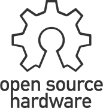

# Ribbit Network Frog Sensor
<!-- ALL-CONTRIBUTORS-BADGE:START - Do not remove or modify this section -->

<!-- ALL-CONTRIBUTORS-BADGE:END -->
[This project will create the world's largest Greenhouse Gas Emissions dataset that will empower anyone to join in the work on climate and provide informed data for climate action.](https://ribbitnetwork.org/)

Ribbit Network is a large network of open-source, low-cost, Greenhouse Gas (CO2 and hopefully other gasses in the future) Detection Sensors. These sensor units will be sold by the Ribbit Network and will upload their data to the cloud, creating the world's most complete Greenhouse Gas dataset.

This repository contains the design files, software, documentation, and assembly instructions for the Frog Sensor.

## Frog Sensors
Our “Frogs” are tiny sensors that you can build and deploy at your own home! It’s a small, 
open-source device that measures the amount of CO2 in the air using a tiny laser.
It's easy to set up and will constantly record valuable scientific data on our climate.

Frogs are one of the species that are most affected by climate change! 
Just like our sensors, they ribbit to one another to create a powerful network 
of data about the environment.

## Build a Frog!
We encourage you to jump in and build your own Frog Sensor! It's recommended
to build a V4 Frog and the instructions from this repo are rendered into a nice webpage at the link below:

[Build a Frog Sensor!](https://ribbit-network.github.io/ribbit-network-frog-hardware/)

There have been four major versions of the Frog Sensor to date. We currently recommend building version 4 of the Frog and this repo contains the files and instructions relevant to V4.

* Frog Sensor Version 4 - This version of the sensor is based on an esp32 microcontroller.
* [Frog Sensor Version 3](https://github.com/Ribbit-Network/ribbit-network-frog-hardware/tree/hw_v3) - This version is based on a Raspberry Pi CM4 and includes a fully 3D printed enclosure.
* [Frog Sensor Version 2](https://github.com/Ribbit-Network/ribbit-network-frog-hardware/tree/hw_v2) - This version is based on a Beaglebone black and includes a fully 3D printed enclosure.
* [Frog Sensor Version 1](https://github.com/Ribbit-Network/ribbit-network-frog-hardware/tree/hw_v1) - This version was based on the Raspberry Pi and included an off-the-shelf enclosure

See each folder linked above for the relevant design files, CAD, and assembly instructions!

## Need Help?
[If you are not sure where to start or just want to chat join our developer slack here.](https://join.slack.com/t/ribbitnetworkgroup/shared_invite/zt-2vxvbo7ld-S36SgfDiev~ZQ2zvp03FOg). You can also [start a discussion](https://github.com/Ribbit-Network/ribbit-network-frog-sensor/discussions) right here in Github.

# View the Data!
The first prototype sensors are up and running! [Here is some real data from our sensor network!](https://dashboard.ribbitnetwork.org/) (Note this dashboard is still experimental and may be down occasionally).

[See more about the cloud database here.](https://github.com/Ribbit-Network/ribbit-network-dashboard)

## Questions?
[Check out the Frequently Asked Questions section.](https://github.com/Ribbit-Network/ribbit-network-faq) If you don't see your question, let us know either in a Github Discussion or via chat.

## Ribbit Frog V4
This is the hardware repository that contains all the design files for the physical assembly of the Frog Sensor.

## Bill of Materials (Parts List)
The hardware [Bill of Materials is located here.](ribbit_network_frog_sensor_bom.csv)

## Mechanical CAD Files
The mechanical design files are hosted on Onshape. Onshape is available to use for free with public assemblies and you can create a copy of the assembly for any edits you would like to make.

[Link to Onshape Assembly](https://cad.onshape.com/documents/b3e6eeabf50d585d20f25fc6/w/a4a82302d129f025f23b244a/e/c221edb50cd05a98d22970e2?renderMode=0&uiState=64a86ef7086f6a55cf1984e7)

## Electronics Block Diagram

The diagram above can be edited with drawio or with the awesome [Draw.io Visual Studio Code Plugin](https://marketplace.visualstudio.com/items?itemName=hediet.vscode-drawio)

## Get Involved
Are you interested in getting more involved or leading an effort in the Ribbit Network project? We are recruiting for additional members to join the Core Team. [See the Open Roles and descriptions here.](https://ribbitnetwork.notion.site/Core-Team-Role-Postings-105df298e0634f179f8f063c01708069).

## Contributing
See the [Issues](https://github.com/keenanjohnson/ghg-gas-cloud/issues) section of this project for the work that I've currently scoped out to be done. Reach out to me if you are interested in helping out! The [projects section](https://github.com/Ribbit-Network/ribbit-network-frog-sensor/projects) helps detail the major efforts going on right now.

We have a [contributing guide](https://github.com/Ribbit-Network/ribbit-network-frog-sensor/blob/main/CONTRIBUTING.md) that details the process for making a contribution.

[If you are not sure where to start or just want to chat join our developer slack here.](https://join.slack.com/t/ribbitnetworkgroup/shared_invite/zt-2vxvbo7ld-S36SgfDiev~ZQ2zvp03FOg). You can also [start a discussion](https://github.com/Ribbit-Network/ribbit-network-frog-sensor/discussions) right here in Github.

## Background Information
[See the Wiki for background research.](https://ribbitnetwork.notion.site/Learnings-Low-cost-sensors-for-the-measurement-of-atmospheric-composition-e3d41736c49e41ad81dcdf7e16a6573b) This project is inspired by some awesome research by incredible scientists in academia.

## Ribbit Network
Ribbit Network is a non-profit (501c3) creating the world's largest Greenhouse Gas Emissions dataset that will empower anyone to join in the work on climate and provide informed data for climate action. We're an all volunteer team building everything we do in the open-source community.

If you would like to consider sponsoring Ribbit Network you can do [via this link](https://givebutter.com/ribbitnetwork). The money is used to pay for software fees, purchase R&D hardware and generally support the mission of Ribbit Network.

## Ribbit Network Code of Conduct
By participating in this project, you agree to follow the <a href="https://ribbitnetwork.notion.site/Ribbit-Network-Code-of-Conduct-and-anti-harassment-policy-cc998ef83e7d4ae7abc95508ee6f2b0d">Ribbit Network Code of Conduct and Anti-Harassement Policy</a>.
Violations can be reported anonymously by filling out this <a href="https://docs.google.com/forms/d/e/1FAIpQLSemQSAER8az1lNGoWkL1udsv6O8oPc1WQ3dvQ0b9fJSSMeetQ/viewform">form</a>. 

## Contributors ✨

Thanks goes to these wonderful people ([emoji key](https://allcontributors.org/docs/en/emoji-key)):

<!-- ALL-CONTRIBUTORS-LIST:START - Do not remove or modify this section -->
<!-- prettier-ignore-start -->
<!-- markdownlint-disable -->
<table>
  <tbody>
    <tr>
      <td align="center"><a href="https://www.linkedin.com/in/ericaudiffred/"> <b>Eric Audiffred</b></a> <a href="#design-eaudiffred" title="Design">🎨</a> <a href="#ideas-eaudiffred" title="Ideas, Planning, & Feedback">🤔</a> <a href="https://github.com/Ribbit-Network/ribbit-network-frog-hardware/commits?author=eaudiffred" title="Tests">⚠️</a></td>
      <td align="center"><a href="https://github.com/djgood"> <b>Desmond Good</b></a> <a href="#ideas-djgood" title="Ideas, Planning, & Feedback">🤔</a> <a href="https://github.com/Ribbit-Network/ribbit-network-frog-hardware/commits?author=djgood" title="Code">💻</a> <a href="#projectManagement-djgood" title="Project Management">📆</a></td>
      <td align="center"><a href="http://laurencewatson.com"> <b>Laurence Watson</b></a> <a href="https://github.com/Ribbit-Network/ribbit-network-frog-hardware/commits?author=Rabscuttler" title="Tests">⚠️</a> <a href="https://github.com/Ribbit-Network/ribbit-network-frog-hardware/commits?author=Rabscuttler" title="Documentation">📖</a> <a href="#ideas-Rabscuttler" title="Ideas, Planning, & Feedback">🤔</a> <a href="#projectManagement-Rabscuttler" title="Project Management">📆</a></td>
      <td align="center"><a href="https://spestana.github.io/"> <b>Steven Pestana</b></a> <a href="https://github.com/Ribbit-Network/ribbit-network-frog-hardware/commits?author=spestana" title="Documentation">📖</a> <a href="#ideas-spestana" title="Ideas, Planning, & Feedback">🤔</a> <a href="#data-spestana" title="Data">🔣</a> <a href="https://github.com/Ribbit-Network/ribbit-network-frog-hardware/commits?author=spestana" title="Tests">⚠️</a> <a href="#financial-spestana" title="Financial">💵</a></td>
      <td align="center"><a href="https://github.com/sanfk2"> <b>sanfk2</b></a> <a href="https://github.com/Ribbit-Network/ribbit-network-frog-hardware/commits?author=sanfk2" title="Code">💻</a></td>
      <td align="center"><a href="https://github.com/eren-rudy"> <b>Eren Rudy</b></a> <a href="https://github.com/Ribbit-Network/ribbit-network-frog-hardware/commits?author=eren-rudy" title="Tests">⚠️</a> <a href="https://github.com/Ribbit-Network/ribbit-network-frog-hardware/commits?author=eren-rudy" title="Documentation">📖</a></td>
      <td align="center"><a href="https://github.com/daveb377"> <b>David Bengtson</b></a> <a href="#ideas-daveb377" title="Ideas, Planning, & Feedback">🤔</a> <a href="#projectManagement-daveb377" title="Project Management">📆</a></td>
    </tr>
    <tr>
      <td align="center"><a href="https://www.linkedin.com/in/lancebantoto/"> <b>Lance Bantoto</b></a> <a href="#ideas-lwbantoto" title="Ideas, Planning, & Feedback">🤔</a> <a href="#projectManagement-lwbantoto" title="Project Management">📆</a></td>
      <td align="center"><a href="https://github.com/kevinjmiller2"> <b>Kevin Miller</b></a> <a href="#ideas-kevinjmiller2" title="Ideas, Planning, & Feedback">🤔</a> <a href="#content-kevinjmiller2" title="Content">🖋</a></td>
      <td align="center"><a href="https://balena.io"> <b>Marc Pous</b></a> <a href="https://github.com/Ribbit-Network/ribbit-network-frog-hardware/commits?author=mpous" title="Tests">⚠️</a></td>
      <td align="center"><a href="https://abesto.net"> <b>Zoltán Nagy</b></a> <a href="https://github.com/Ribbit-Network/ribbit-network-frog-hardware/commits?author=abesto" title="Code">💻</a></td>
      <td align="center"><a href="https://github.com/eliasfallon"> <b>eliasfallon</b></a> <a href="https://github.com/Ribbit-Network/ribbit-network-frog-hardware/commits?author=eliasfallon" title="Documentation">📖</a></td>
      <td align="center"><a href="https://github.com/rhampt"> <b>Ryan</b></a> <a href="https://github.com/Ribbit-Network/ribbit-network-frog-hardware/commits?author=rhampt" title="Documentation">📖</a></td>
      <td align="center"><a href="https://github.com/akhilgupta1093"> <b>akhilgupta1093</b></a> <a href="https://github.com/Ribbit-Network/ribbit-network-frog-hardware/commits?author=akhilgupta1093" title="Code">💻</a></td>
    </tr>
    <tr>
      <td align="center"><a href="https://github.com/pascaljoly"> <b>outdoorclone</b></a> <a href="https://github.com/Ribbit-Network/ribbit-network-frog-hardware/commits?author=pascaljoly" title="Documentation">📖</a></td>
      <td align="center"><a href="https://github.com/muditprotect3d"> <b>Mudit Agrawal</b></a> <a href="#design-muditprotect3d" title="Design">🎨</a></td>
    </tr>
  </tbody>
</table>

<!-- markdownlint-restore -->
<!-- prettier-ignore-end -->

<!-- ALL-CONTRIBUTORS-LIST:END -->

This project follows the [all-contributors](https://github.com/all-contributors/all-contributors) specification. Contributions of any kind welcome!
