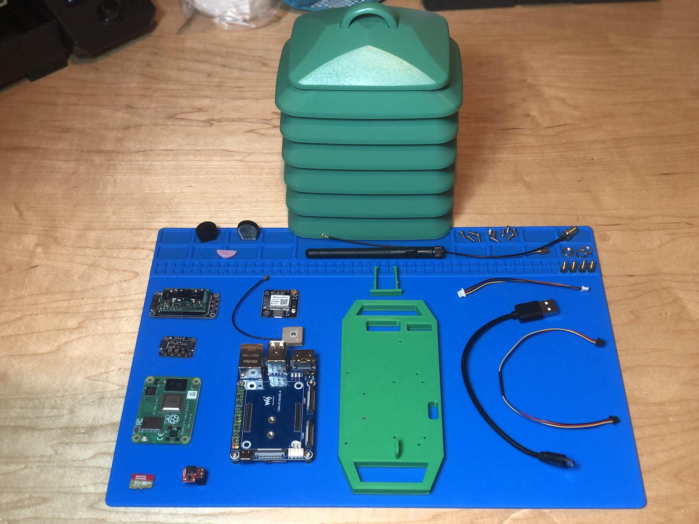

# Parts List

The first step is building a Frog Sensor is to get all of the parts. You can find the [parts list or Bill of Materials (BOM) here.](https://docs.google.com/spreadsheets/d/1lsWCXFawsJNGc44bqFXWkpjHfIFZQEj5UceJV4AiuK0/edit#gid=0)

The document linked above contains quanitities and links to purchase all of the parts you'll need to build a Frog.

Note that there are several 3D printed parts that you'll need to 3D print yourself. The next section will cover that in more detail.

## Next Step
[3D Printing](2-3d-printing.md)

## Previous Step
[Go Back](0-start-here.md)

## Table of Contents
[Return to the Beginning](0-start-here.md)

## Need Help?
No problem! The Ribbit Netowrk team is here for you! We have lots of ways to connect. Jump in and ask your question or provide a suggestion!
* [Start a dicussion here](https://github.com/Ribbit-Network/ribbit-network-frog-sensor/discussions/new)
* [Join the Developer Discord](https://discord.gg/vq8PkDb2TC)