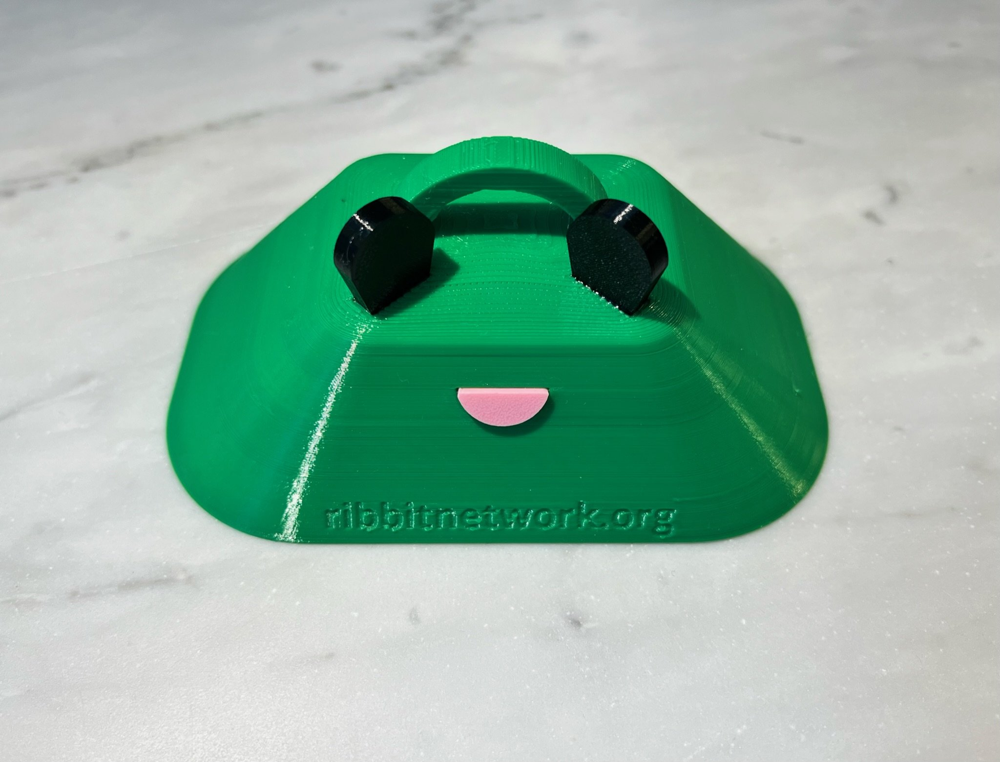
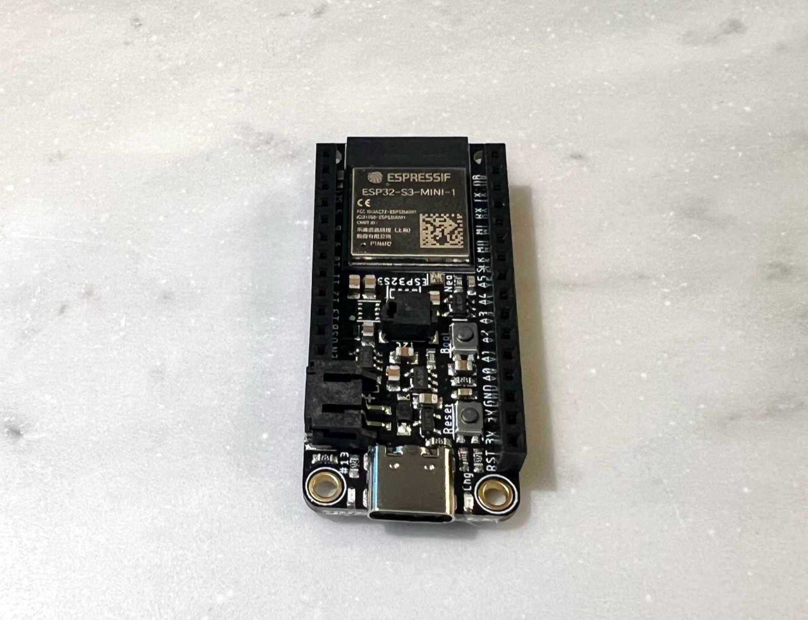
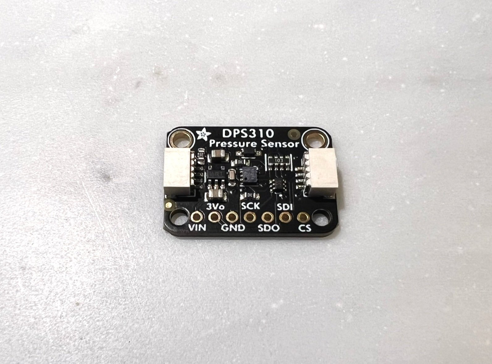
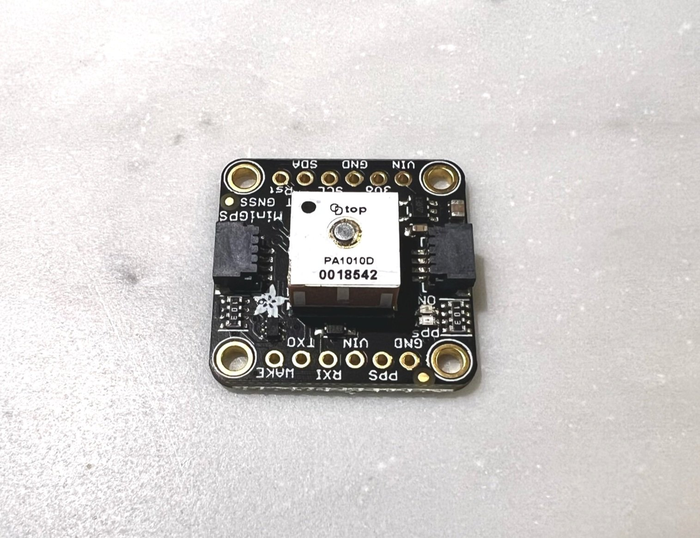
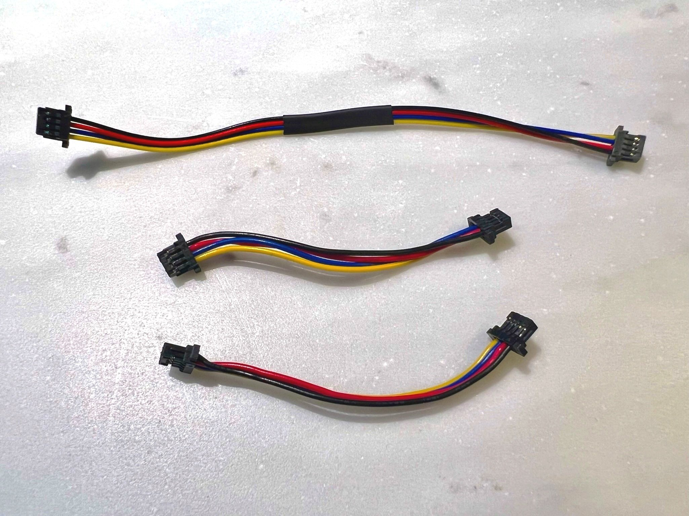
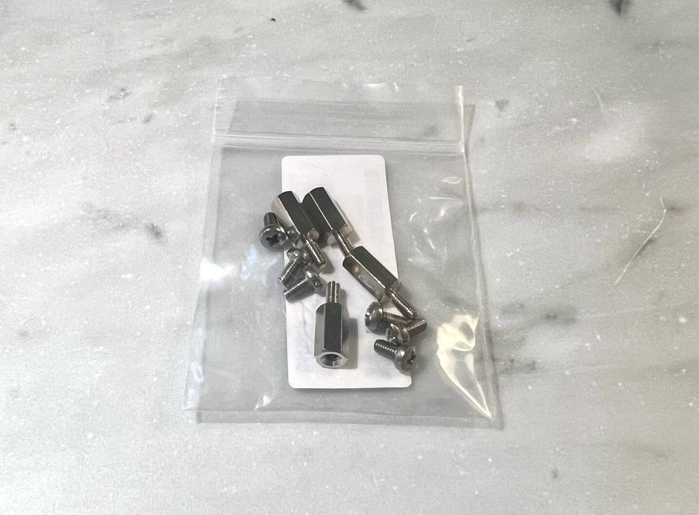
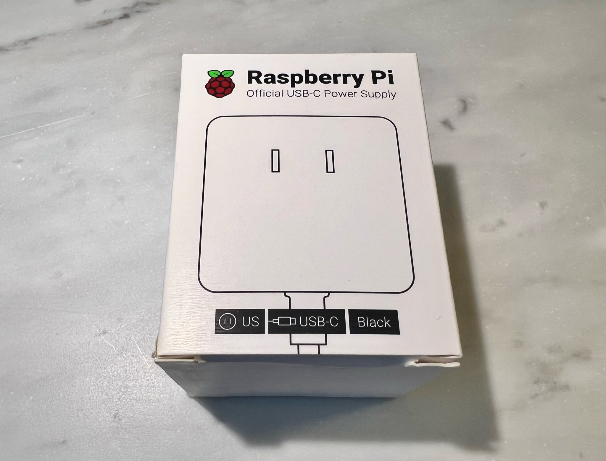
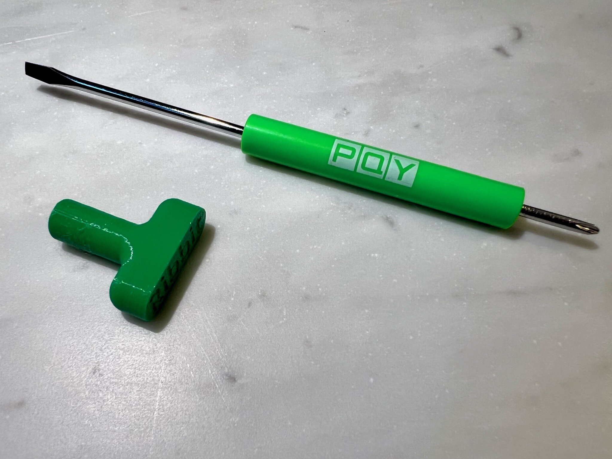

# Parts List

The first step in building a Frog Sensor is to get all of the parts.

This section walks through what the different parts are, and how to buy them.

If you have a received a Frog sensor kit, it includes everything you need, including the tools!

If you don't have a kit, no worries! All the parts are available to purchase and 3D print yourself. See the [Purchase Parts](#purchase-parts) section.

## 3D Printed Parts

Your Frog enclosure is made of several 3D printed parts. 

These parts are made from recycled plastic using a 3D printer if you have received them in a kit and we suggest trying out a recycled plastic if you are printing your own. See more in the [3D Printing Page](../2-3d-printing/2-3d-printing.md)

The head is the cap that sits on top and protects everything inside from rain / weather. It also looks quite fun.

The shroud is a second layer of protection that both protects the sensors inside, but also allows air flow to the sensors. This multi-layer shroud is called a [Stevenson screen.](https://en.wikipedia.org/wiki/Stevenson_screen) and is used in scientific instruments around the world.

The Frog body is where the power connnection enters and contains the tiny computer (microcontroller) that serves as the brain of the Frog.

Finally, the lid snaps onto the body and seals it from the outdoors.

This is a mounting bracket used to mount the Frog in it's permanent home. The mounting section will discuss that more later.

## Electronics

There are many electronic parts that make a up a Frog.

### Microcontroller

This is the brain of the Frog. It’s where the software that runs on the Frog lives. This board also includes a wifi radio that allows the Frog to connect to the internet via Wifi where it is available.

### Right Angle USB Connector

This connects the microcontroller to the external power supply or usb cable.

### CO2 & Humidity Sensor

This is a CO2 sensor that also measure temperature and relative humidity.

It is a [Nondispersive infrared sensor](https://en.wikipedia.org/wiki/Nondispersive_infrared_sensor) (NDIR) that can detect concentrations of CO2.

### Barometric Pressure

The Frog includes a barometric pressure sensor or barometer. This sensor measures the atmospheric pressure at the Frog and is very useful for analyzing the CO2 concentration data.

### GPS Sensor

The Frog includes a GPS sensor that can determine the position of the Frog in 3D space.

Latitude and Longitude are important, but researchers also highly value the very accurate altitude reported by the GPS module.

### Cables

The included cables connect all of the sensors to the microcontroller.

### Electronics Mounting Hardware

A small bag contains 6 screws and 4 standoffs which are used to mount the electronics inside the Frog.

## Power Supply

This box contains the power supply for your Frog Sensor. It won’t be used while you are building the Frog, but you will need it once the Frog is finished.

## Tools

### Hardware Tools

Additionally, the assembly instructions call for these tools:

* Custom Ribbit 5mm socket/driver (a standard socket will work as well).
* Small phillips screwdriver

### Data USB Cable

A data ready USB C cable is used for testing your Frog once it is assembled.

## Purchase Parts

You can find the complete parts list or [Bill of Materials (BOM) here.](https://github.com/Ribbit-Network/ribbit-network-frog-hardware/blob/main/ribbit_network_frog_sensor_bom.csv)

All of the parts from Adafruit can be found in this wishlist: [Adafruit Wishlist](http://www.adafruit.com/wishlists/574723)

Scroll to the bottom of the wish list and click the "Add All to Cart" button

The BOM document contains links to purchase the other components (excepts the 3D printed parts).

Note that there are several 3D printed parts that you'll need to 3D print yourself. The next section will cover that in more detail.

## Next Step

If you have received a Frog Sensor kit or are building the kit as part of a workshop, skip to the Assembly step!

[Assembly Step](../4-assembly/4-assembly.md){ .md-button }

Otherwise, it's time to 3D print the enclosure parts.

[3D Printing](../2-3d-printing/2-3d-printing.md){ .md-button }

## Table of Contents

[Return to the Beginning](../index.md){ .md-button }

## Need Help?

No problem! The Ribbit Network team is here for you! We have lots of ways to connect. Jump in and ask your question or provide a suggestion!

[Start a discussion here](https://github.com/Ribbit-Network/ribbit-network-frog-sensor/discussions/new){ .md-button }

[Join the Developer Discord](https://discord.gg/vq8PkDb2TC){ .md-button }
