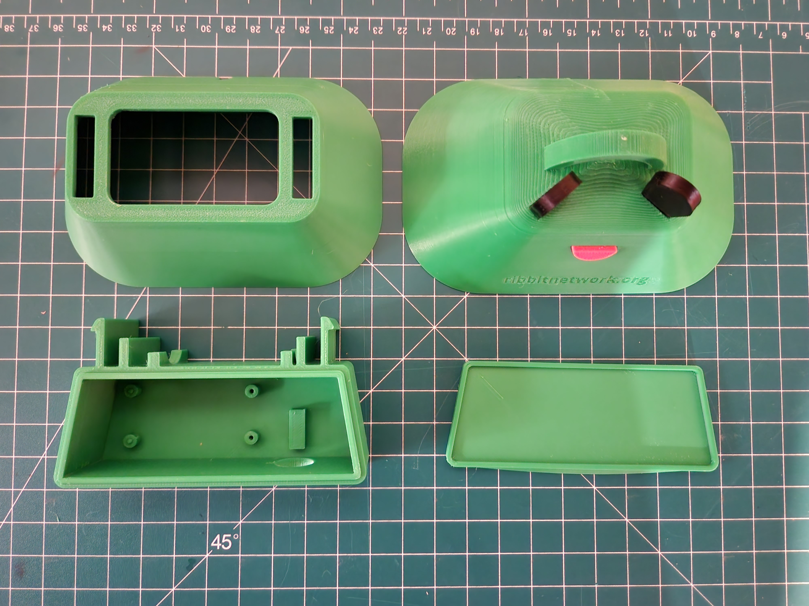

# 3D Printing

There are several 3D printed parts you'll need to print in order to build a Frog Sensor. All parts can be found [in this folder](../mechanical).

## Minimum Parts
These are the parts required for the Frog Sensor construction:
* Enclosure Base
  * Quantity:1
  * Suggested Color: Green
* Enclosure Lid
  * Quantity:1
  * Suggested Color: Green
* Lower Shroud
  * Quantity:1
  * Suggested Color: Green
* Frog Head - With Eyes
  * Quantity:1
  * Suggested Color: Green
  * This can be printed with eyes and mouth all as a green piece or you can
  print the eyes and mouth as unique pieces in different colors and glue together.

## Bonus Parts
These parts only serve a cosmetic function and are therefore optional. 
However, they are fun and cute, so we suggest including them if you can.

* 1 - Frog Head - No Eyes
  * Quantity:1
  * Suggested Color: Green
* 2 - Frog Eyes
  * Quantity:2
  * Suggested Color: Black
* 1 - Frog Mouth
  * Quantity:1
  * Suggested Color: Pink

## Print Materials
Given that the sensors are designed to sit outside, a PETG 3D Printer Filament should be used for all the parts. This kind of filament is readily available and can be used on almost any 3D printer. It holds up well in moisture and is very UV resistant making it perfect for the sensor. The [parts list](https://docs.google.com/spreadsheets/d/1lsWCXFawsJNGc44bqFXWkpjHfIFZQEj5UceJV4AiuK0/edit#gid=0) links to some suggestions for brands and colors.

## Next Step
[Software](3-software.md)

## Table of Contents
[Return to the Beginning](0-start-here.md)

## Need Help?
No problem! The Ribbit Network team is here for you! We have lots of ways to connect. Jump in and ask your question or provide a suggestion!
* [Start a discussion here](https://github.com/Ribbit-Network/ribbit-network-frog-sensor/discussions/new)
* [Join the Developer Discord](https://discord.gg/vq8PkDb2TC)
