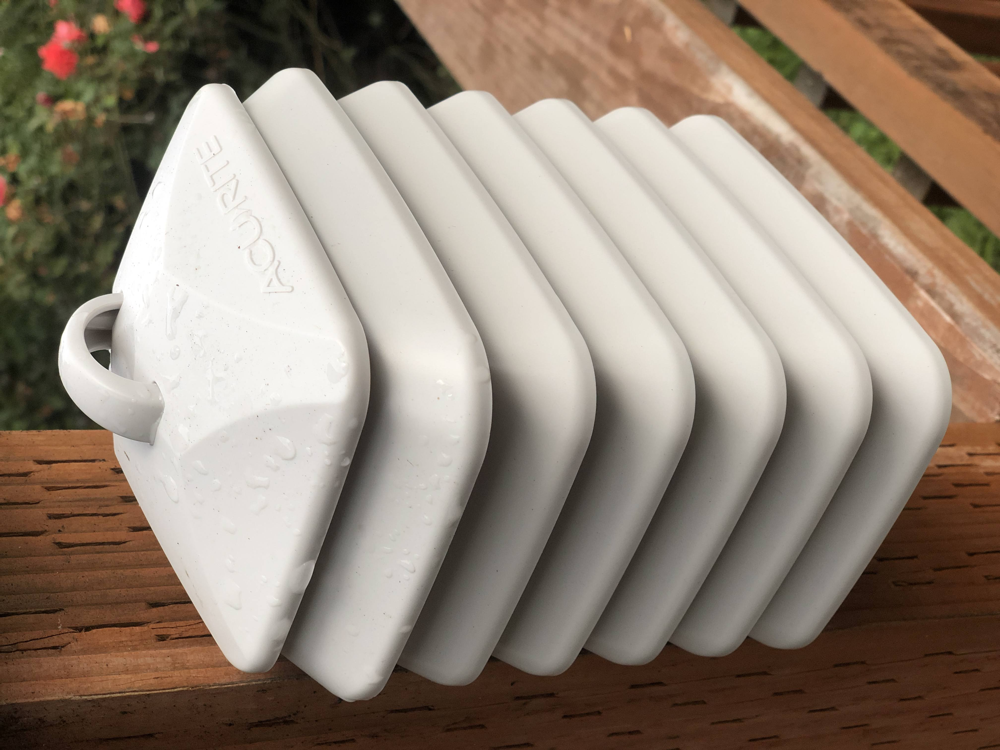
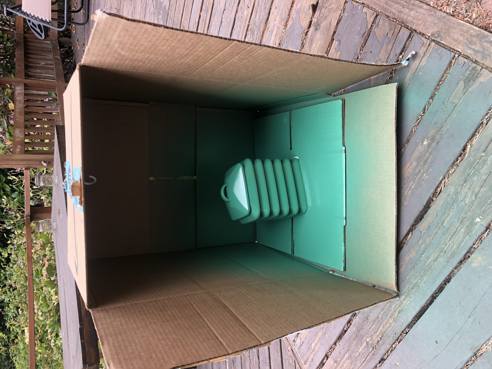
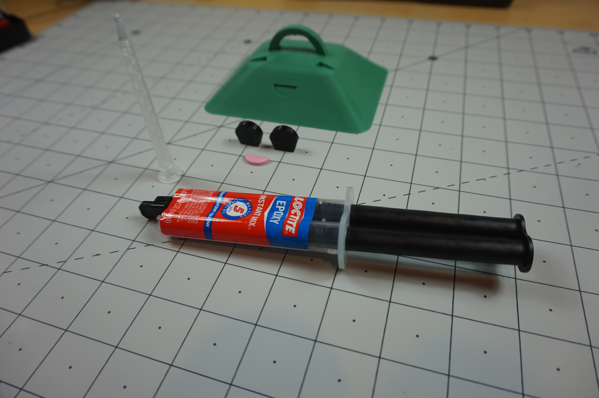
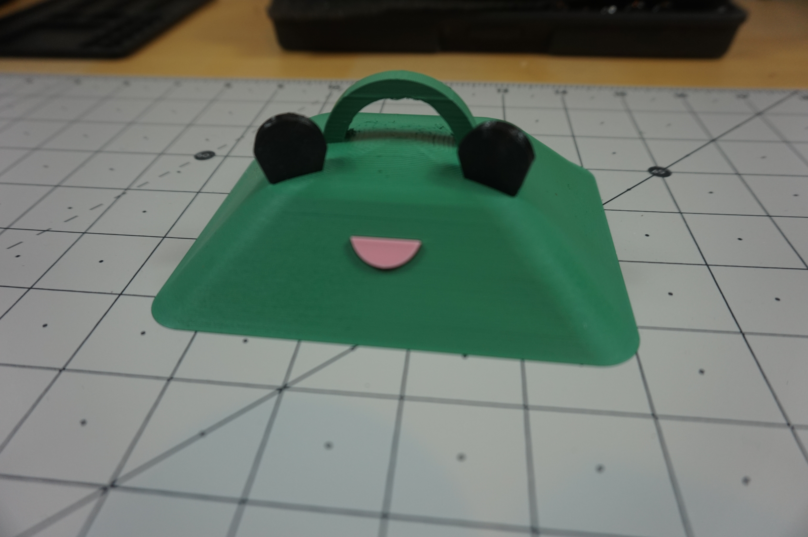
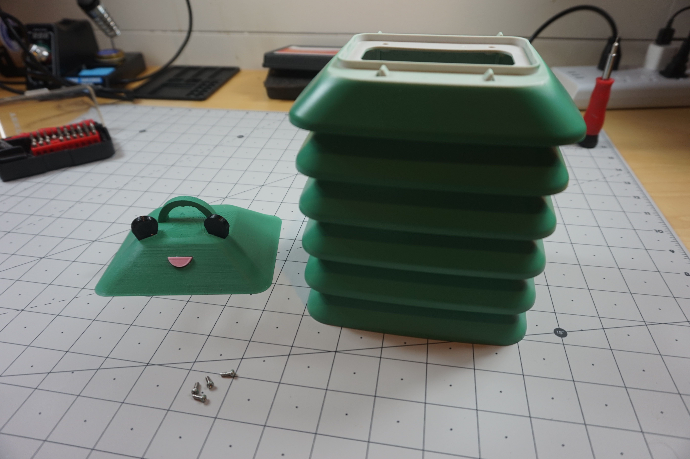
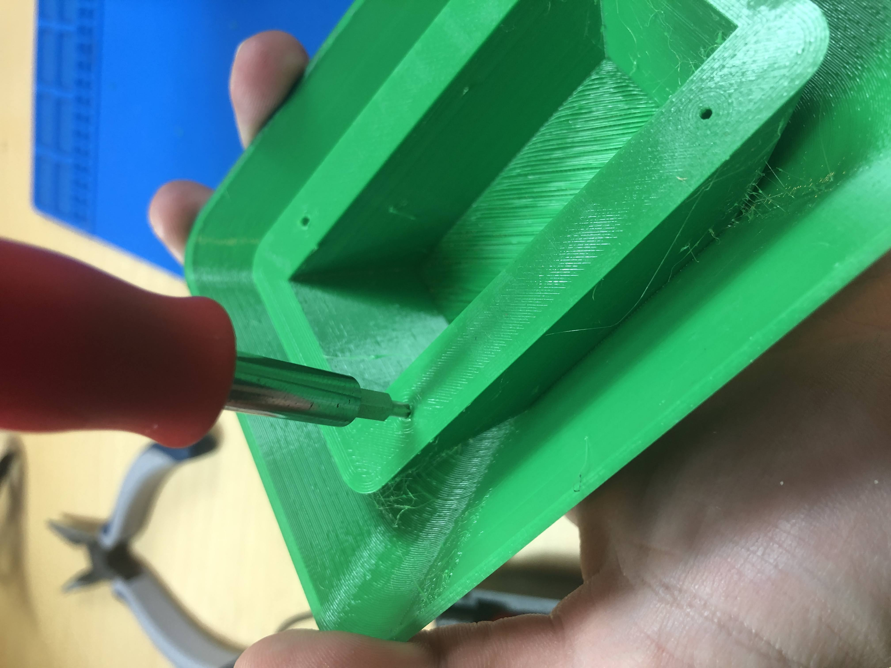
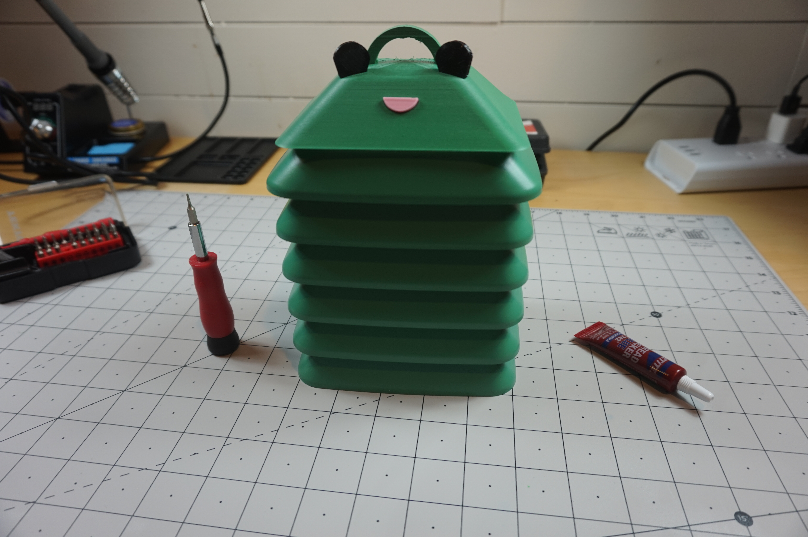

# Enclosure Assembly

The main body of the enclosure is called a [Stevenson screen](https://en.wikipedia.org/wiki/Stevenson_screen) and should arrive like this.

The sensor will function fine with the enclosure as is, but most people choose to add the cute frog head features and some paint to improve the aesthetics of the enclosure. If you aren't planning to do that, you can skip this step and head to the [Electronics Section.](4-electronics.md)

## Painting the Enclosure
This is the time to paint the Frog Head. We do this before we attach the eyes and mouth so that we don't change their color :smile:.

The [Krylon Outdoor Décor Spray Paint, Shamrock](https://www.amazon.com/Krylon-Outdoor-Decor-Paint-Shamrock/dp/B072RPLT81) results in a nice color.

## Glueing the Head

The eyes and mouth need to be glued to the head after printing (note if you are planning on painting the head, it's best to do this before glueing the eyes and mouth on).

Just add a small dab of epoxy into the slots for the eyes and moutn and insert the pieces!

## Attaching the Head

Firstly, we need to attach the main body of the head to the rest of the enclosure.

To do this, we need to remove the top layer of the Stevenson screen. This is done by removing 4 screws on the inside of the enclosure.

Once that's done, you can attach the head to the top of the enclosure using the 4 screws removed in the last step and the four screw holes in the 3D printed frog head. 

Remember to keep the plastic flexible piece in between the head and the rest of the enclosure! This is what will hold the electronics bracket inside later.

**Note:** You may have to use a small screw driver to widen the holes a bit depending on the quality of your 3D print.

## Done!
Now the cute enclosure is done!

## Next Step
[Electronics Weatherproofing [OPTIONAL]](4-electronics-weatherproofing.md)

## Previous Step
[Go Back](2-3d-printing.md)

## Table of Contents
[Return to the Beginning](0-start-here.md)

## Need Help?
No problem! The Ribbit Network team is here for you! We have lots of ways to connect. Jump in and ask your question or provide a suggestion!
* [Start a discussion here](https://github.com/Ribbit-Network/ribbit-network-frog-sensor/discussions/new)
* [Join the Developer Discord](https://discord.gg/vq8PkDb2TC)
