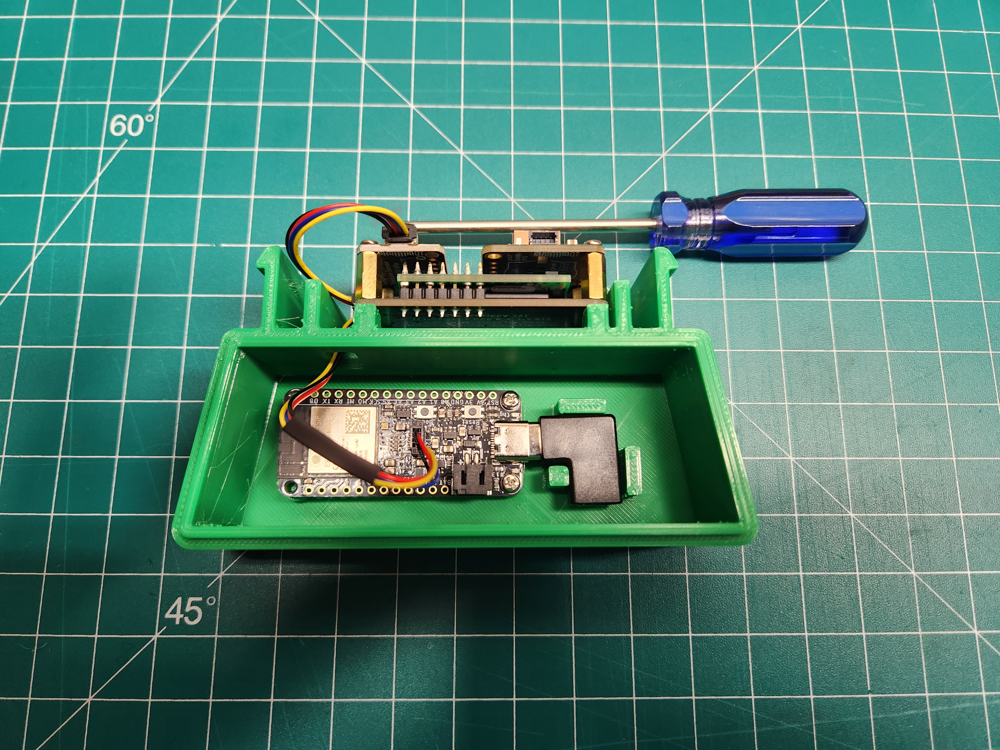
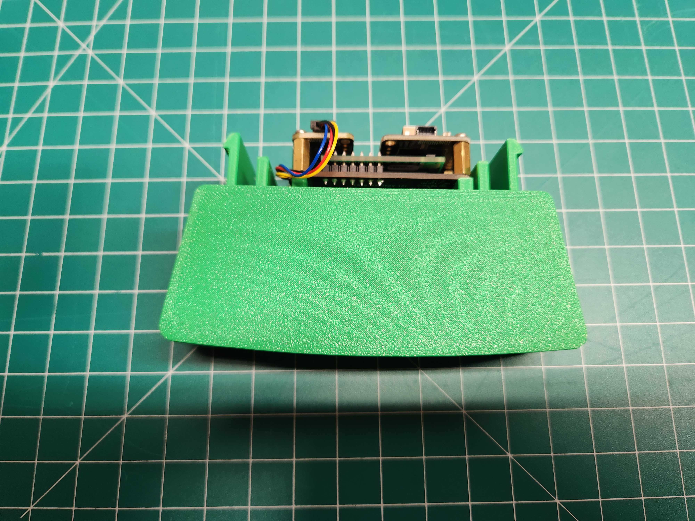
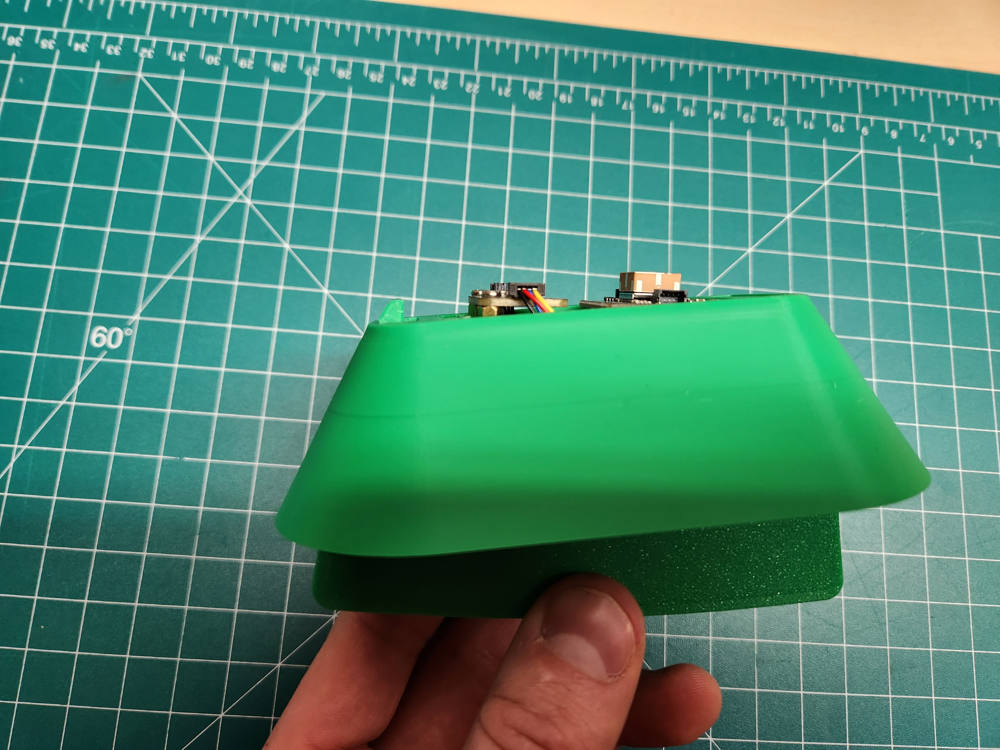
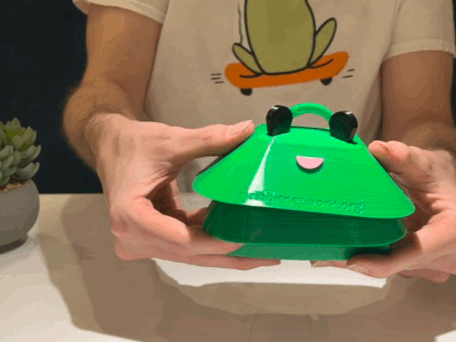

# Assembly

Now to assemble everything!  Follow these directions:

## Plug cables into the SDC-30 sensor

First, we need to attach two cables (100mm and 50mm) to the SDC-30.  

As shown in the picture, the 100mm cable is plugged into the top port and the 50mm cable is plugged into the bottom port.  

## Install the SDC-30 sensor on the enclosure base

Now the SDC-30 is ready to be mounted on the enclosure base.  You will need the SDC-30 with attached cables, the four long brass standoffs, enclosure base, and the 5mm socket.  You can also use the custom Ribbit 5mm driver.  

First, route the 100mm cable through the hole in the top of the enclosure.

Next, use the four long brass standoffs to mount the SDC-30 to the top of the enclosure.  The 5mm socket should be used to screw in the brass standoffs.  Do not over tighten, just snug up.

## Install the Barometer

To mount the barometer you will need two M2.5 screws and a small phillips screwdriver.

The Barometer sits on the two long brass standoffs above the cable ports on the SDC-30.  Use the screws to secure it in place.

Plug the 50mm cable from the SDC-30 into the front of the barometer.

## Install the GPS

To mount the GPS you will need two M2.5 screws and a small phillips screwdriver.  

The GPS sits on top of the two remaining long brass standoffs, opposite the barometer.  Use the two screws to secure the GPS in place.

Now use the second 50mm cable to connect the barometer and GPS

## Install the ESP32 Feather

First, connect the 100mm cable to the port in the center of the ESP32.  Then connect the USBC 90 degree adapter to the power port.

Note: you may need to remove the cap from the port in the center of the ESP32.

Now the ESP32 can be mounted in the enclosure base using the remaining two M2.5 screws and the small phillips screwdriver.

## Assemble the Enclosure

Now we can move on to assembling the enclosure.  The lid will come first.  
Simply snap the lid into place on top of the base.

## Snap on the Shroud

The lower shroud snaps into place.

To snap in place, slide one side of the shroud into place on the clip.  Then press firmly on the other side to snap it down as well.

## Install the Frog Head

The frog head snaps on top of the shroud.

Use firm, but not excessive, pressure to snap the Frog Head into place.  This snap functions just like the shroud in the previous step.

## Assembly Complete

The assembly is complete! Now it is time to test if the Frog is working correctly.

Note, if you are assembling this Frog as part of a workshop, the testing steps are optional, but encouraged!

## Next Step

[Sensor Testing](../5-testing/5-sensor-testing.md){ .md-button }

## Table of Contents

[Return to the Beginning](../index.md){ .md-button }

## Need Help?

No problem! The Ribbit Network team is here for you! We have lots of ways to connect. Jump in and ask your question or provide a suggestion!

* [Start a discussion here](https://github.com/Ribbit-Network/ribbit-network-frog-sensor/discussions/new)
* [Join the Developer Discord](https://discord.gg/vq8PkDb2TC)
