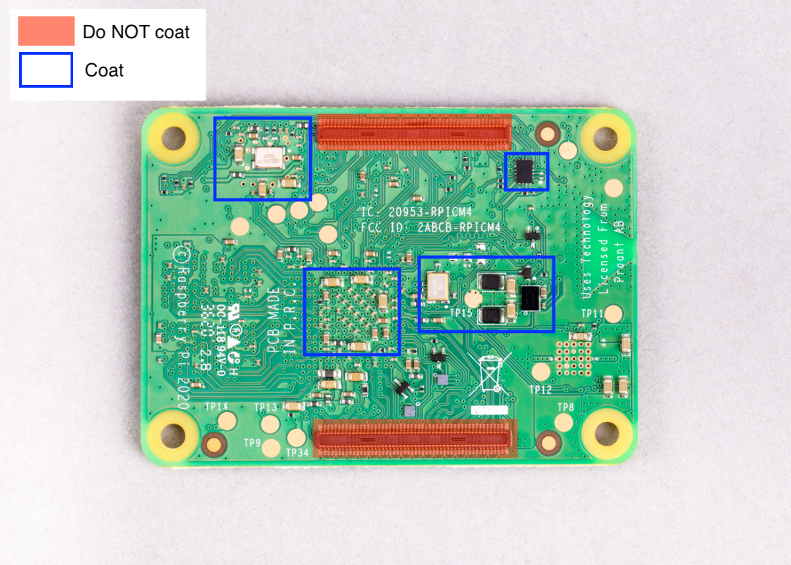
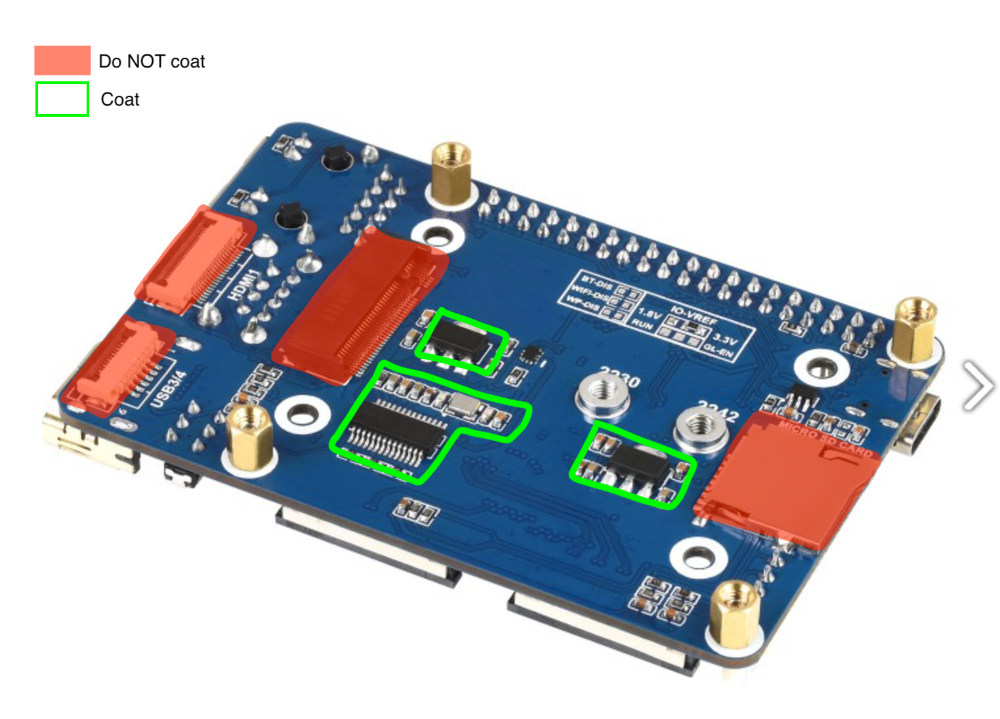
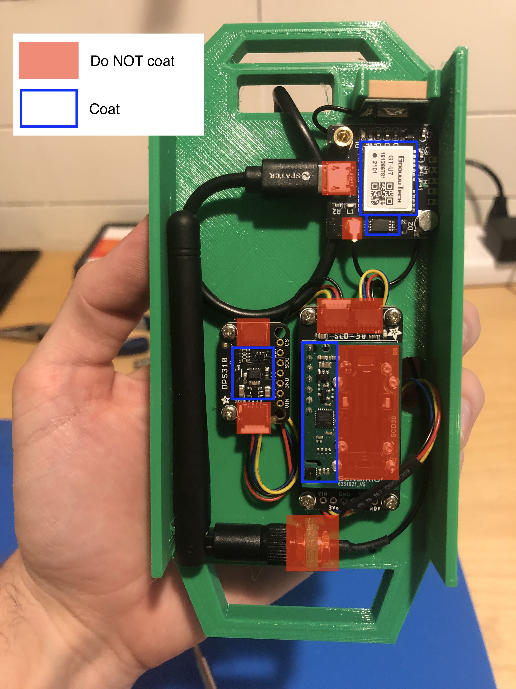

# Electronics Weatherproofing [OPTIONAL]

Electronic components are prone to long-term damage when exposed to adverse environmental conditions such as high humidity or transient temperature conditions.

In order to mitigate the effects of this damage, electronics can be protected with [conformal coating](https://www.mgchemicals.com/category/conformal-coating/).

This step is optional, but highly encouraged in order for you to get the most longevity out of your Frog Sensor! 

## Parts needed

Of course, you will need the Frog Sensor electronics components.

You will also need a conformal coating. We recommend that you use a liquid bottle and brush it on -- as opposed to using an aerosol spray, which can be messy. The one listed in the [BOM](../hardware/ribbit_network_frog_sensor_bom.csv) (under 'Consumables') will work, but of course feel free to use any other conformal coating solution that you prefer. 

## Apply conformal coating

Please follow the appropriate directions for using your conformal coating of choice; different coats may require different cure times and different safety considerations. 

The below images display the parts on the electronics that we recommend covering with the conformal coat. You can coat more of the board if you would like, but try to avoid coating any of the connectors (highlighted in RED below).

### Bottom of the Raspberry Pi Compute Module 4

### Bottom of the Raspberry Pi Base Board

### Top of Raspberry Pi Compute Module

### Sensors (CO2, Barometer, GPS)

## Next Step
[Electronics Assembly](5-electronics-assembly.md)

## Previous Step
[Go Back](3-enclosure.md)

## Table of Contents
[Return to the Beginning](0-start-here.md)

## Need Help?
No problem! The Ribbit Network team is here for you! We have lots of ways to connect. Jump in and ask your question or provide a suggestion!
* [Start a discussion here](https://github.com/Ribbit-Network/ribbit-network-frog-sensor/discussions/new)
* [Join the Developer Discord](https://discord.gg/vq8PkDb2TC)
