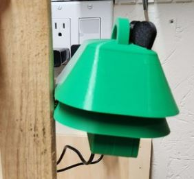

# Sensor Placement

Now it's time to place the sensor in its home outside your home.

You can use the loop on the top of the sensor to hang the sensor somewhere or use the slot on the backside to hang the sensor on a nail.  There are also two accessory hooks that can be used to making haning easier.

The location will need to be near a power outlet to ensure there is power for the sensor. Ideally it should be as high as possible and out of direct sunlight as much as possible to prevent rapid temperature changes. Try to ensure the space above the sensor is largely unobstructed so that the GPS unit can obtain an accurate position (don't place the sensor in a shed for instance).

## Power Cable

Connect the USBC power supply to the USBC connector through the bottom of the enclosure and plug the sensor into a normal wall outlet. If your USBC power supply is connected to an extension cord, you may want to protect that connection from the weather in an enclosure. Search online for weatherproof extension cord covers, outdoor electrical boxes, or build your own out of a waterproof container. Make sure that all the cables enter through an opening in bottom of the enclosure so that water can’t collect inside.

The power cable can be routed through the bottom:

## Hanging / Mounting

It’s time to place the sensor in its home outside so that it can collect data about the planet.

There are several options for mounting the Frog shown below.

### S-Hook

If you would like to mount your Frog to a railing or existing hook outdoors, the kit includes an “S” shaped hook for attaching to the top of the Frog head.

### Nail Mounting

### Post Mount

The Frog Sensor can be mounted to a pole using the 3D printed pole mount.

To attach the bracket to a pole, use a few zip ties slotted through the holes in the bracket.

The bracket clips onto the lower layer of the sensor shroud.

Clip the Frog onto the bracket. Make sure it feels secure.

Great! The Frog is ready to go!

## Next Step

[View the data!](../6-done/6-done.md)

## Table of Contents

[Return to the Beginning](../index.md)

## Need Help?

No problem! The Ribbit Network team is here for you! We have lots of ways to connect. Jump in and ask your question or provide a suggestion!

* [Start a discussion here](https://github.com/Ribbit-Network/ribbit-network-frog-sensor/discussions/new)
* [Join the Developer Discord](https://discord.gg/vq8PkDb2TC)
* [Email](mailto:keenan.johnson@gmail.com)
