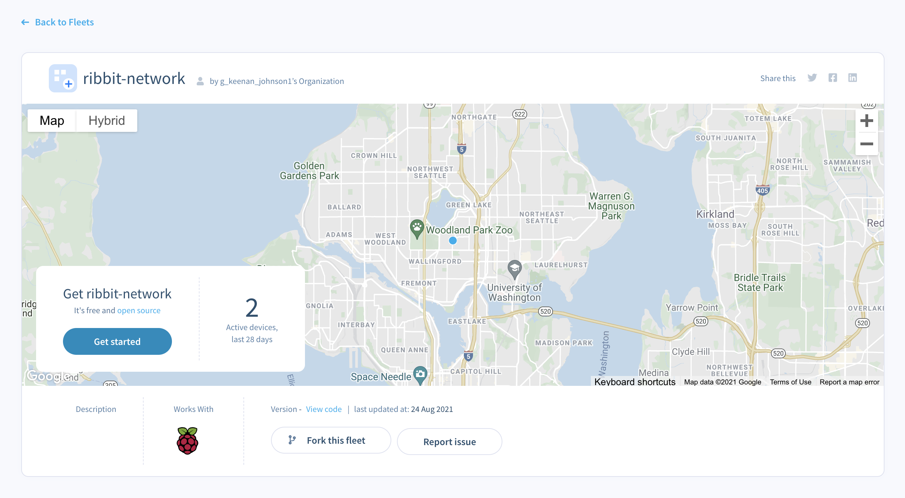

# Software

Now it's time to install the software we need on the SD card for the Frog Sensor. You'll need an SD card reader for this step.

## Download the software
The Ribbit Network team uses a service called [balena](https://www.balena.io/) to manage the software updates for all Frog sensors.

In order to add your sensor to the Ribbit Network, you'll need to download the latest software from our balena Fleet and flash it to the SD card.

To do this, [visit this link.](https://hub.balena.io/g_keenan_johnson1/ribbit-network) You'll see the image below. Click on the "Get Started" button

The next screen will present you with a few options. For network conenction, you'll want to select "Wifi + Ethernet" and enter your wifi connection details. Don't worry, these are kept secret and no one on the balena or Ribbit Network team can ever access them.

Once that's done, click the "Download balenaOS" button at the bottom and follow the instructions shown on the right!

## Flash the SD Card

You will need to download a program called [Etcher](https://www.balena.io/etcher/) to flash the downloaded file onto the SD Card.

Once Etcher is installed and you have the image, do the following:

1. Click "Select image" and find your fleet's balenaOS image file.
2. If you haven't already done so, insert your SD card into your computer. Etcher will automatically detect it. If you have more than one SD card inserted, you will need to select the appropriate one.
3. Click the "Flash!" button.

# Insert the SD Card into the Frog Sensor
Now that the SD card is ready to go, remove it from your computer and insert it into the Raspberry Pi SD card slot on the bottom of the sensor.

## Next Step
[Sensor Placement](6-sensor-placement.md)

## Previous Step
[Go Back](4-electronics.md)

## Table of Contents
[Return to the Beginning](0-start-here.md)

## Need Help?
No problem! The Ribbit Netowrk team is here for you! We have lots of ways to connect. Jump in and ask your question or provide a suggestion!
* [Start a dicussion here](https://github.com/Ribbit-Network/ribbit-network-frog-sensor/discussions/new)
* [Join the Developer Discord](https://discord.gg/vq8PkDb2TC)