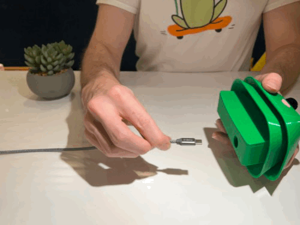
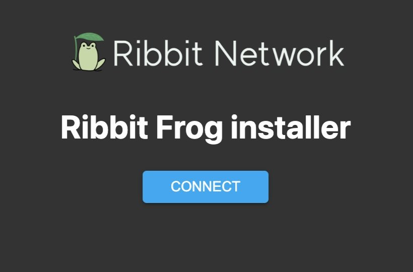
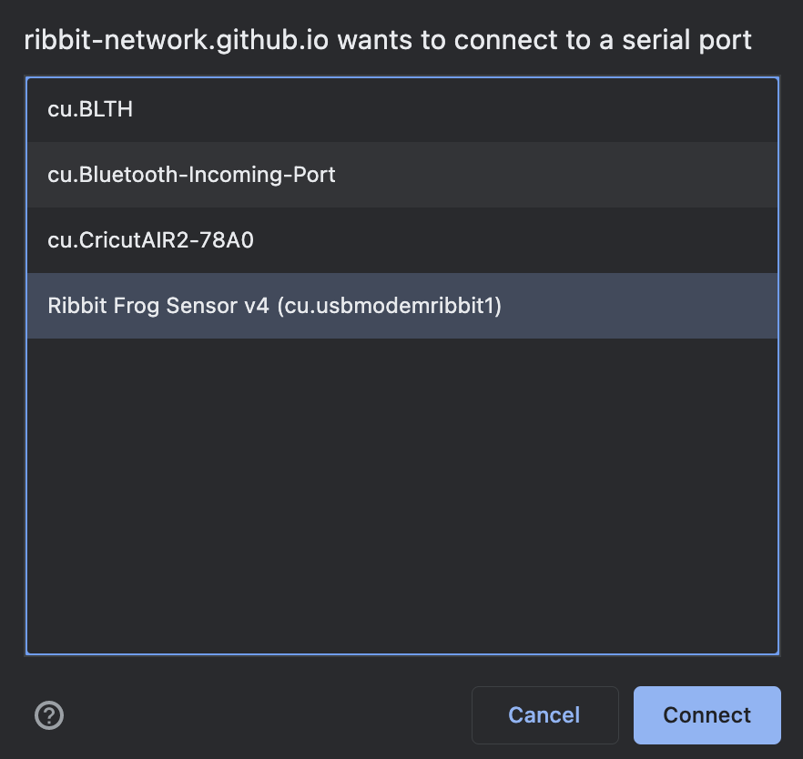
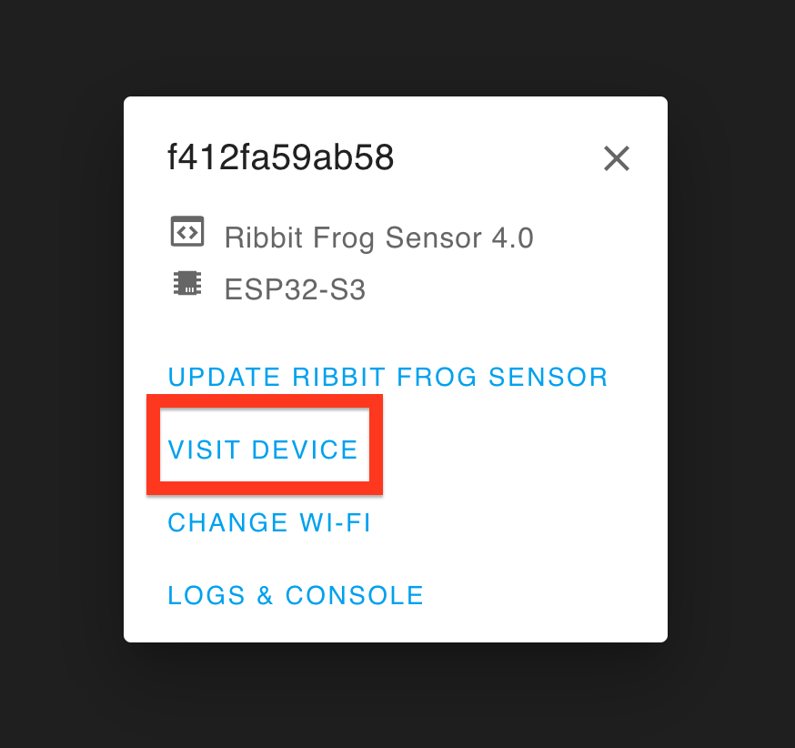
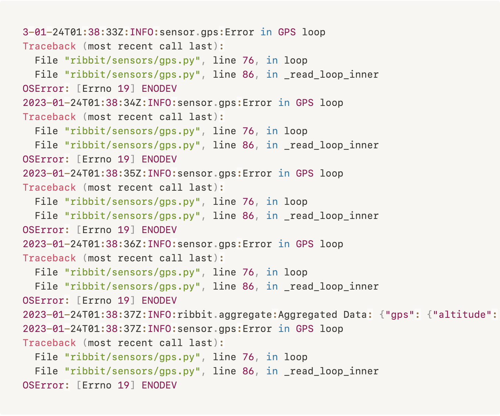

# Sensor Testing

Now that assembly is complete, it’s time to test that everything is working properly with your Frog before installing it outside.

## Connect the Frog to a Computer

Connect the included USB cable to the Frog and then to your computer.

Once the Frog is connected, visit [this website](https://keenanjohnson.github.io/ribbit-network-frog-software-trial-kit/) to test your Frog. Once there, hit the Connect button.

[Connect Website Link](https://keenanjohnson.github.io/ribbit-network-frog-software-trial-kit/){ .md-button }

You will see a list of USB devices connected to your computer. Select “Ribbit Network Frog Sensor” and hit “Connect”.

## Testing Via Wifi

This is an optional section if you have a wifi connection available to connect the Frog to. Although the Frog kit also includes a cellular module, we always suggest connecting to wifi when able as it uses less power and is more sustainable for the planet.

If there is no wifi connection available, skip to the [No Wifi Section below.](#no-wifi-testing)

To connect to a wifi network, select the “Change Wifi” option in the webpage menu.

Select the wifi network from the drop-down menu and enter the correct password. Hit the “Connect” button.

Make sure your computer is connected to the same wifi network as the Frog. Select the “Visit Device” button.

This will open a website hosted by your Frog Sensor. It shows the data and status of the connection to all of your sensors.

The GPS sensor most likely won’t be able to get a connection while the sensor is inside, however. If you are able, you can try taking your Frog outside to verify that the GPS is working.

If there is a red light on the barometer or co2 sensor, it means that the microcontroller cannot talk to the sensor. Double-check that all the cables are connected correctly in the previous steps.

## No Wifi Testing

If there is no wifi connection available, you can verify the device is working via the Frog’s console logs.

Start by selecting the “Logs & Console” option.

You should see your Frog Sensor printing out some data on the console. This means everything is working properly!

If your Frog is having a problem communicating with its sensors, you will see an error in the log like the one shown. 

If you are seeing an error like this, check all of your cables to make sure they are fully connected.

This is an example error showing a disconnected GPS sensor.

## Testing Complete

Great work! The testing is complete and the Frog is ready to be installed outside.

## Next Step

[Sensor Testing](../6-sensor-placement/6-sensor-placement.md)

## Table of Contents

[Return to the Beginning](../index.md)

## Need Help?

No problem! The Ribbit Network team is here for you! We have lots of ways to connect. Jump in and ask your question or provide a suggestion!

* [Start a discussion here](https://github.com/Ribbit-Network/ribbit-network-frog-sensor/discussions/new)
* [Join the Developer Discord](https://discord.gg/vq8PkDb2TC)
