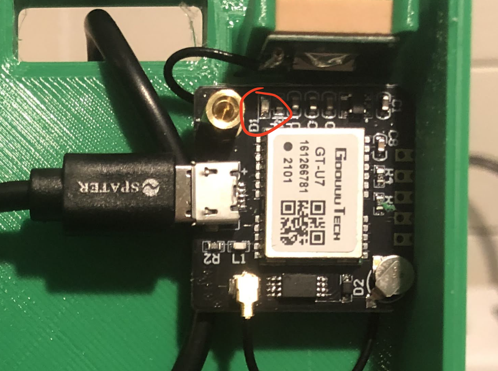

# Debugging
If you are reading this page, something isn't work with your sensor. Don't panic and follow the steps below to identify the issue and resolve it.

## Problem Sensor Does Not Appear on Map
If you have received or built your Frog Sensor, powered it up, but still don't see it on the map, follow the steps below to identify the issue!

1. Verify that the sensor is connected to power by verifying you see some LEDs on the electronics inside.
2. Verify that the sensor is connected to a wifi network. This can be verified by ensuring the device is NOT broadcasting the "Wifi-Connect" SSID and by checking the ACT LED on the Raspberry Pi (see image below). If there is a connectivity issue, the ACT LED will flash a repeated pattern of 4 short flashes followed by a pause.

3. Once wifi connectity is verified, the next most likely issue is that the GPS sensor does have a clear enough view of the sky to establish a GPS location. You can verify this by checking the LED on the GPS module. If the LED is blinking then a GPS location fix is established and everything is great. However, if the light on the GPS module is solid, then the module cannot establish a fix. Try moving the sensor to a less obstructed area.

4. If all else fails, try turning the sensor off and on again (Seriously).

## Still Need Help?
No problem! The Ribbit Network team is here for you! We have lots of ways to connect. Jump in and ask your question or provide a suggestion!
* [Start a discussion here](https://github.com/Ribbit-Network/ribbit-network-frog-sensor/discussions/new)
* [Join the Developer Discord](https://discord.gg/vq8PkDb2TC)

## Previous Step
[Go Back](8-done.md)

## Table of Contents
[Return to the Beginning](0-start-here.md)