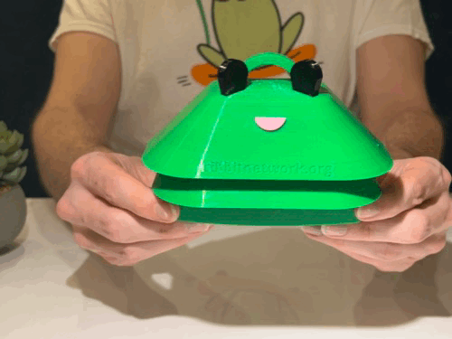

# Welcome

We’re so excited for you to start your Ribbit journey! Ribbit Network inspires students, teachers, hackers, and scientists to take direct action by building a sensor and contributing to an open-source globally-distributed climate observation network.

## Table of Contents

Note, if you are building your Frog sensor from a kit as part of a corporate workshop, [skip directly to the Assembly step!](4-assembly/4-assembly.md)

1. [Parts List (Bill of Materials)](1-parts/1-parts.md)
2. [3D Printing](2-3d-printing/2-3d-printing.md)
3. [Software Installation](3-software/3-software.md)
4. [Assembly](4-assembly/4-assembly.md)
5. [Placement of Finished Sensor](5-sensor-placement/5-sensor-placement.md)
6. [You did it!](6-done/6-done.md)
7. [Something is Wrong](7-debugging/7-debugging.md)

## Need Help?

No problem! The Ribbit Network team is here for you! We have lots of ways to connect. Jump in and ask your question or provide a suggestion!

* [Start a discussion here](https://github.com/Ribbit-Network/ribbit-network-frog-sensor/discussions/new)
* [Join the Developer Discord](https://discord.gg/vq8PkDb2TC)

## Improve These Instructions

This is an open-source project for citizen scientists like yourself! We are always looking for ways to improve the documentation. If you have suggestions or see a change you could make, we encourage you to do so! See the [contribution guide](https://github.com/Ribbit-Network/ribbit-network-frog-sensor/blob/main/CONTRIBUTING.md) for how to make the change!

## Get started

[Let's build!](1-parts/1-parts.md)
