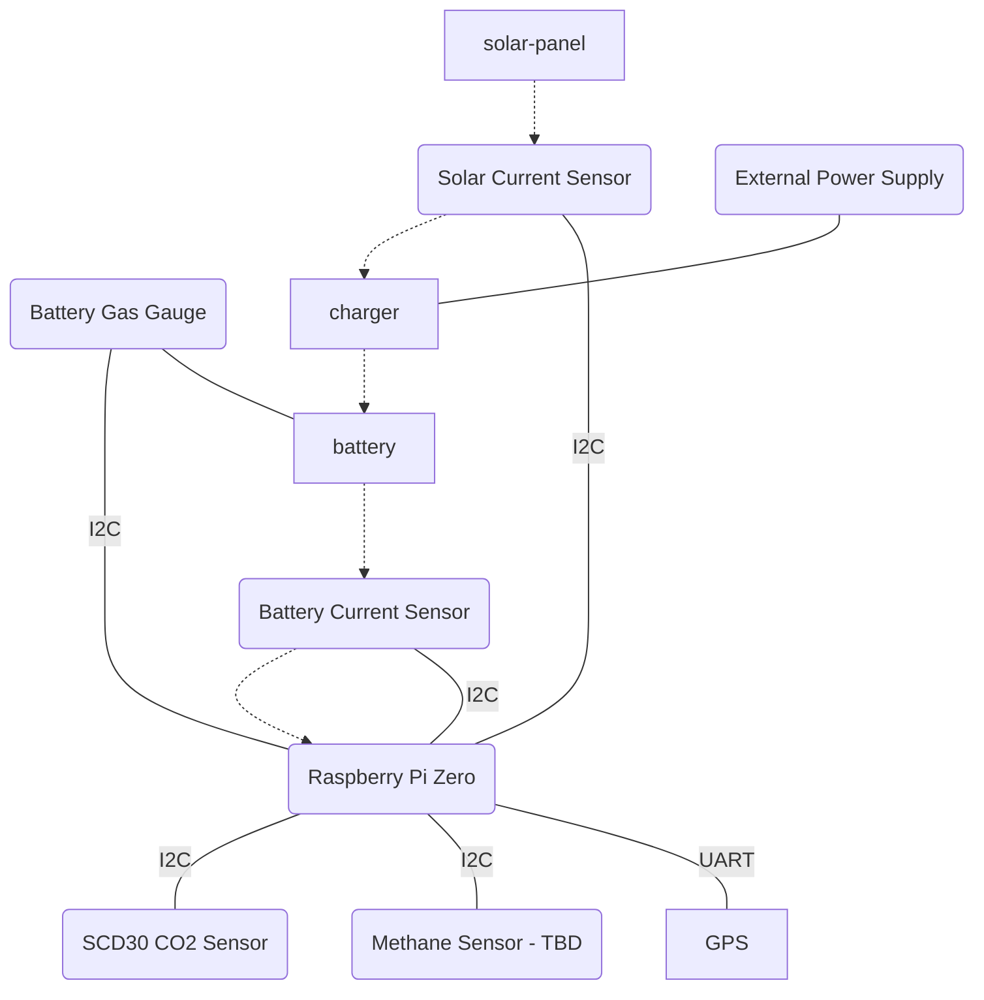

```mermaid
graph TD;
    pi(Raspberry Pi Zero)
    co2(SCD30 CO2 Sensor)
    methane(Methane Sensor - TBD)
    gg(Battery Gas Gauge)
    scurrent(Solar Current Sensor)
    bcurrent(Battery Current Sensor)
    externalpower(External Power Supply)
    pi -- I2C --- co2;
    pi -- I2C --- methane;
    pi -- UART --- GPS;
    battery .-> bcurrent;
    bcurrent .-> pi
    gg -- I2C --- pi;
    gg --- battery;
    solar-panel .-> scurrent;
    scurrent .-> charger;
    scurrent -- I2C --- pi;
    bcurrent -- I2C --- pi;
    charger .-> battery;
    externalpower --- charger;
```
