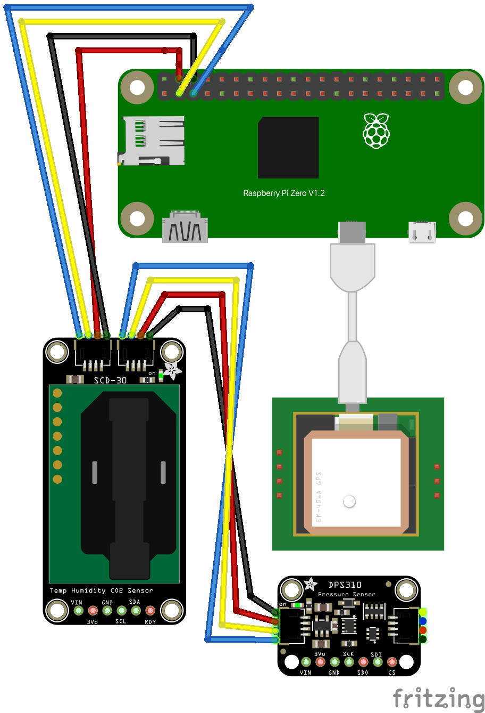

## Overview
The hardware [Bill of Materials is located here.](https://github.com/Ribbit-Network/ribbit-network-frog-sensor/blob/main/hardware/Frog%20Sensor%20-%20Ribbit%20Network%20Bill%20of%20Materials%20-%20BOM.csv)

Currently most components are off the shelf, though this will likely become less true as the Frog sensor matures.

## Wiring Diagram

## Custom Components

The only custom component is a 3D printed bracket that connects the electronics to the enclosure.

## Main Readme

[Head back to the main readme for more info!](https://github.com/Ribbit-Network/ribbit-network-sensor)
