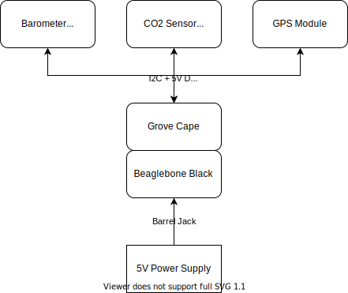

## Ribbit Frog V2
This is the hardware respository that contains all the design files for the physical assembly of the Frog Sensor.

## Bill of Materials (Parts List)

The hardware [Bill of Materials is located here.](ribbit_network_frog_sensor_bom.csv)

We also have an on-going effort to create different versions of the Bill of Materials that  are localized to different regions. See the [Folder here](international_boms) for our current list. We welcome any new contributions!

## Electronics Block Diagram

The diagram above can be edited with drawio or with the awesome [Draw.io Visual Studio Code Plugin](https://marketplace.visualstudio.com/items?itemName=hediet.vscode-drawio)

## Assembly Instructions
Assembly instructions can all be found [here](https://github.com/Ribbit-Network/ribbit-network-frog-sensor/blob/main/assembly-instructions/0-start-here.md).

## 3D Printed Components

There are a few custom components desribed [here](https://github.com/Ribbit-Network/ribbit-network-frog-sensor/blob/main/assembly-instructions/2-3d-printing.md).

## Main Readme

[Head back to the main readme for more info!](https://github.com/Ribbit-Network/ribbit-network-sensor)
