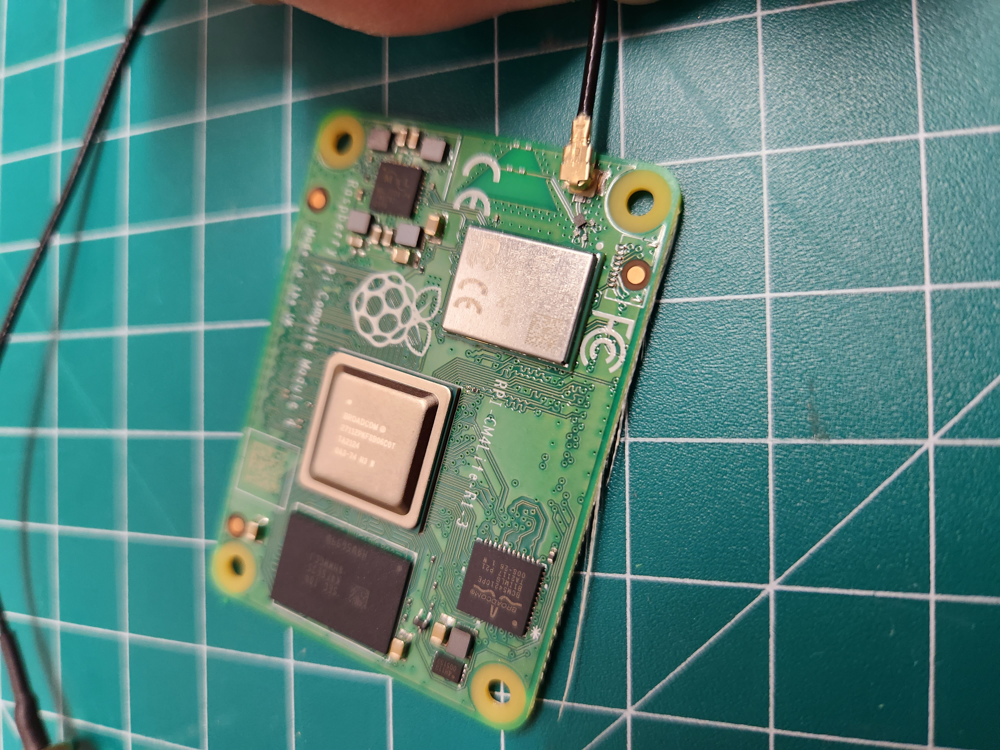
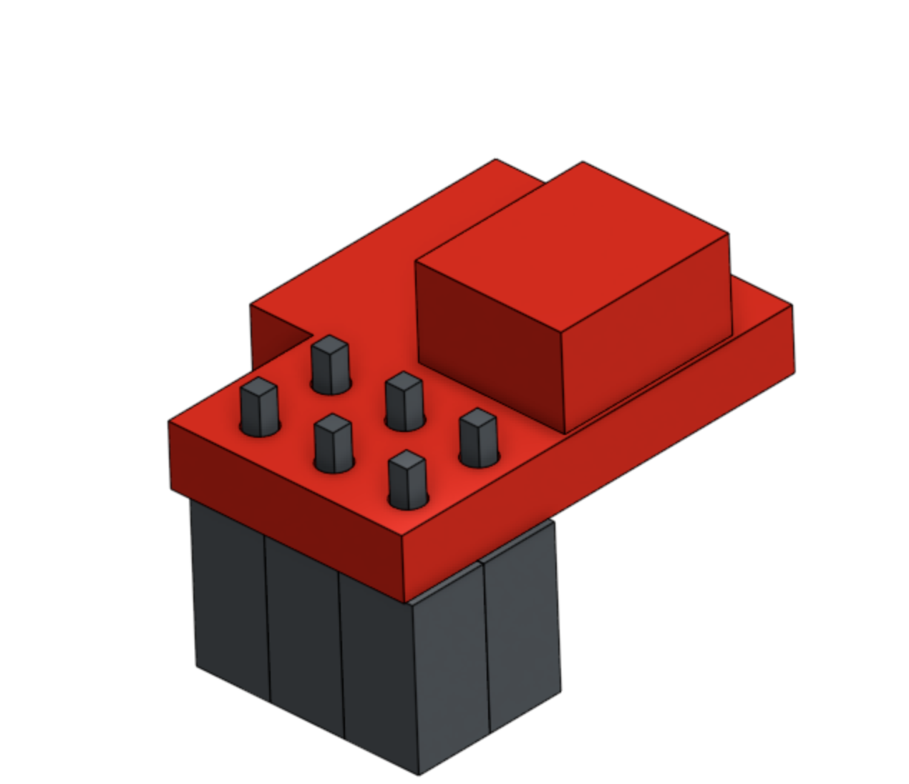

# Assembly
Now to assemble everything!  Below is a picture of all the parts and tools you will need.

## Install the wifi antenna in the base of the enclosure
You will need a 5/16" wrench to remove and tighten the nut on the antenna base.

Separate the antenna base from the antenna extension by unscrewing the two.
Remove the lock washer and nut from the base.

Now insert the antenna base through the mount point on the enclosure base.  Install the lock washer
and nut.  Thread the nut onto the base, but do not tighten all the way.  

Attach the antenna extension to the antenna base by threading the two back together.
Use the 5/16" wrench to tighten.  Do not over tighten.  Snugging it up will work fine.

## Clip the Antenna Cable to the Raspberry Pi CM4

It is easiest to attach the antenna clip onto the Pi CM4 before installing the Pi CM4 onto the carrier board.  

For this step align the clip at the end of the antenna cable up with the port on the CM4

Now firmly pinch the two together.  This takes a little effort!

## Install the Raspberry Pi4 Compute Module onto the Carrier Board

The compute module snaps onto the carrier board as shown:

## Install the Raspberry Pi carrier board
For this step you will need the carrier board, four M2.5mm screws, and a small phillips screwdriver

Place the board on the four mount points molded into the enclosure base.
Use the four screws to secure the board to the mount points. 

## Install four short brass standoffs on top of the enclosure

The four short brass standoffs can be screwed into place on the top of the enclosure base.
There are four holes pre drilled into the top of the enclosure.  
A 5mm socket can be used to tighten the standoffs.

## Plug in cables to the SDC-30 sensor
Next, we need to attach two cables (200mm and 100mm) to the SDC-30.  

As shown in the picture, the 200mm cable is plugged into the right port and the 100mm cable
is plugged into the left port.  

## Install the SDC-30 sensor on the enclosure base
Now the SDC-30 is ready to be mounted on the enclosure base.  You will need the SDC-30 with attached cables,
the four long brass standoffs, and the 5mm socket.

First route the 200mm cable through the hole in the top of the enclosure base.  Then place the SDC-30 on the four short brass standoffs.

Use the four long brass standoffs to secure the SDC-30 in place.  

## Soldering Raspberry Pi qWIIC adapter
The qWIIC adapter, used to connect the CO2 sensor to the Raspberry Pi, comes without headers soldered on.

Slide the qwiic shim onto the header as shown in the model

You'll need to solder at each of the six headers as shown in the close up picture below.  

You'll need to solder on headers to the bottom, like so:

## Install the qWIIC adapter on the Raspberry Pi carrier board

Plug the 200mm cable into the qWIIC adapter as shown:

Plug the qWIIC adaper into place on the bottom six pins of the carrier board.  Orientation shown in picture below.  There is also a closer picture in the next section.  

## Clip the antenna cable into place

The antenna cable clips onto the Raspberry Pi carrier board.  The clip is at the bottom of the board right above the
power port.

## Install the Barometer
To mount the barometer you will need two M2.5mm screws and a small phillips screwdriver.

The Barometer sits on the two long brass standoffs above the cable ports on the SDC-30.  
Use the screws to secure it in place. 

## Install the GPS
To mount the GPS you will need two M2.5mm screws and a small phillips screwdriver.  

The GPS sits on top of the two remaining long brass standoffs, opposite the barometer.  Use the two screws
to secure the GPS in place.

## Finish installing the cables
The free end of the 100mm cable can now be plugged into the GPS.
Plug the cable into the port that is on the back, above the words "MiniGPS".

The cable should now run from the SDC-30 sensor to the GPS.  

Next, the 50mm cable needs to be plugged in.  

The 50mm cable runs from the front of the GPS to the front of the barometer.

## Assemble the enclosure

Now we can move on to assembling the enclosure.  The lid will come first.  
To secure the lid you will ned the two M4 screws and an allen wrench.

The lid attaches to the enclosure base by lining up the groove and then snapping 
into place.  It is then secured with the two M4 screws.  Be sure not to over tighten.  

## Snap on the Shroud
The lower shroud snaps into place.

To snap in place, slide one side of the shroud into place on the clip.  Then press firmly on 
the other side to snap it down as well.

## Assemble the Frog Head
The eyes and mouth need to be glued in place (if printed separate from the head)

Use super glue and place the eyes and mouth just like in the picture:

## Install the Frog Head
The frog head snaps on top of the shroud.

Use firm, but not excessive, pressure to snap the Frog Head into place.  This snap functions just like the shroud
in the previous step.

## Assembly complete!
The assembly is now complete! Now we just need to place our sensor outside!

The power cable can be routed through the bottom:

The Frog Sensor can be hung using the loop on top, or the nail hook on the back.  

## Next Step
[Sensor Placement](5-sensor-placement.md)

## Table of Contents
[Return to the Beginning](0-start-here.md)

## Need Help?
No problem! The Ribbit Network team is here for you! We have lots of ways to connect. Jump in and ask your question or provide a suggestion!
* [Start a discussion here](https://github.com/Ribbit-Network/ribbit-network-frog-sensor/discussions/new)
* [Join the Developer Discord](https://discord.gg/vq8PkDb2TC)
