# Assembly
Now to assemble everything!  Follow these directions:

## Plug cables into the SDC-30 sensor
First, we need to attach two cables (100mm and 50mm) to the SDC-30.  

As shown in the picture, the 100mm cable is plugged into the top port and the 50mm cable is plugged into the bottom port.  

## Install the SDC-30 sensor on the enclosure base
Now the SDC-30 is ready to be mounted on the enclosure base.  You will need the SDC-30 with attached cables, the four long brass standoffs, enclosure base, and the 3/16" socket.

First, route the 100mm cable through the hole in the top of the enclosure.

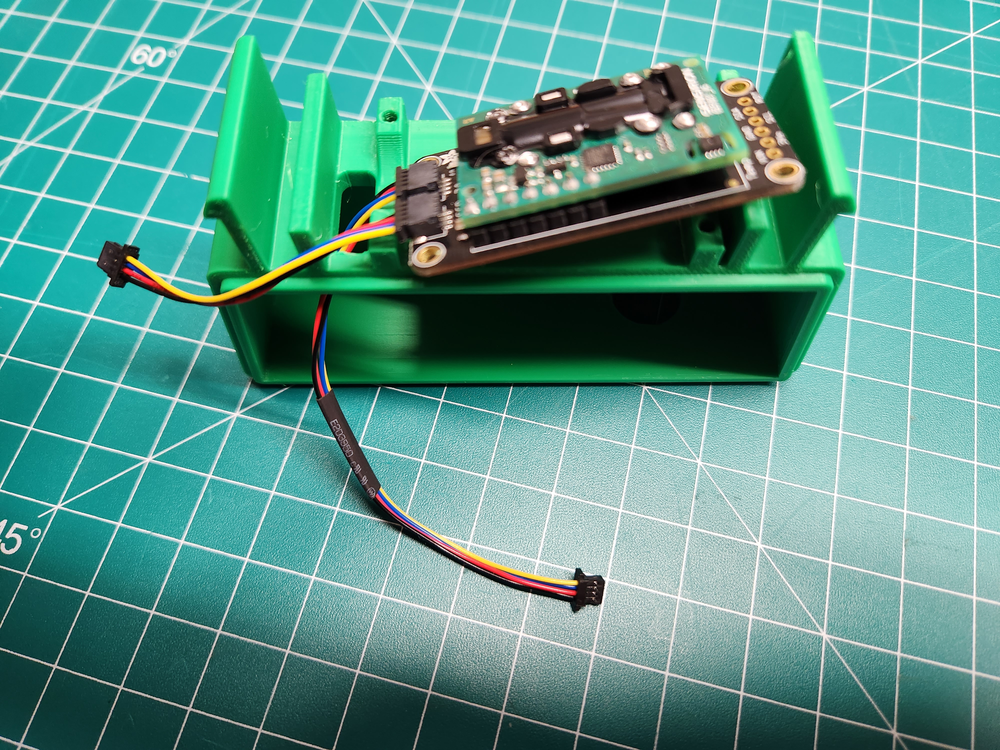

Next, use the four long brass standoffs to mount the SDC-30 to the top of the enclosure.  The 3/16" socket should be used to screw in the brass standoffs.  Do not over tighten, just snug up.

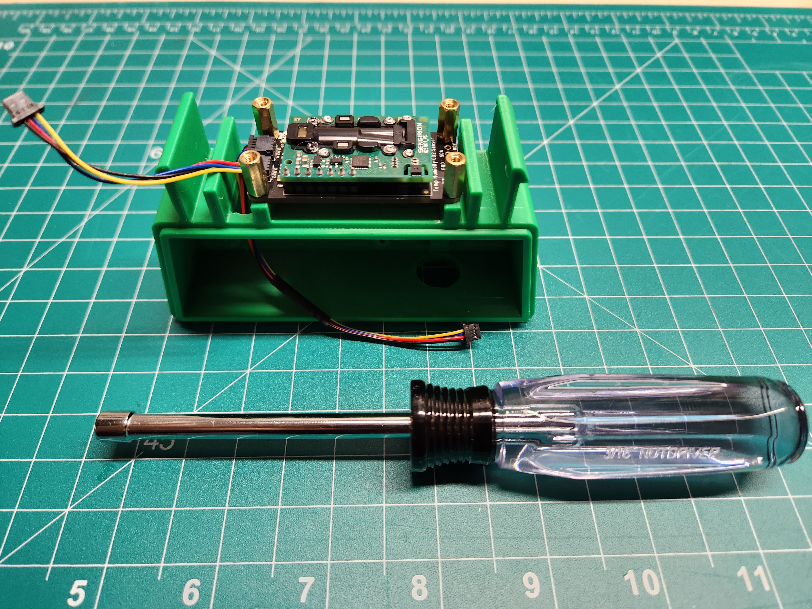

## Install the Barometer
To mount the barometer you will need two M2.5 screws and a small phillips screwdriver.

The Barometer sits on the two long brass standoffs above the cable ports on the SDC-30.  Use the screws to secure it in place. 

Plug the 50mm cable from the SDC-30 into the front of the barometer.

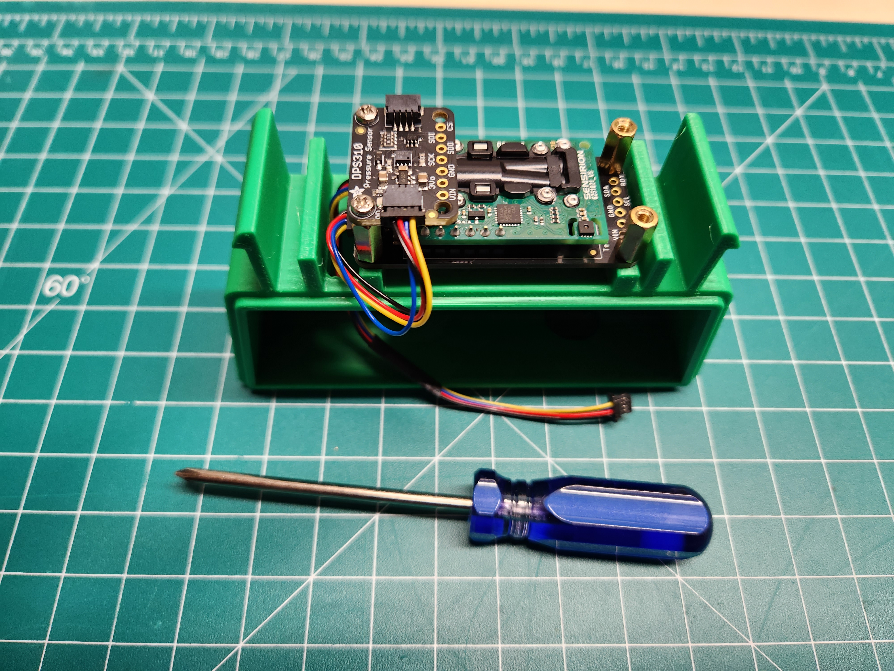

## Install the GPS
To mount the GPS you will need two M2.5 screws and a small phillips screwdriver.  

The GPS sits on top of the two remaining long brass standoffs, opposite the barometer.  Use the two screws to secure the GPS in place.

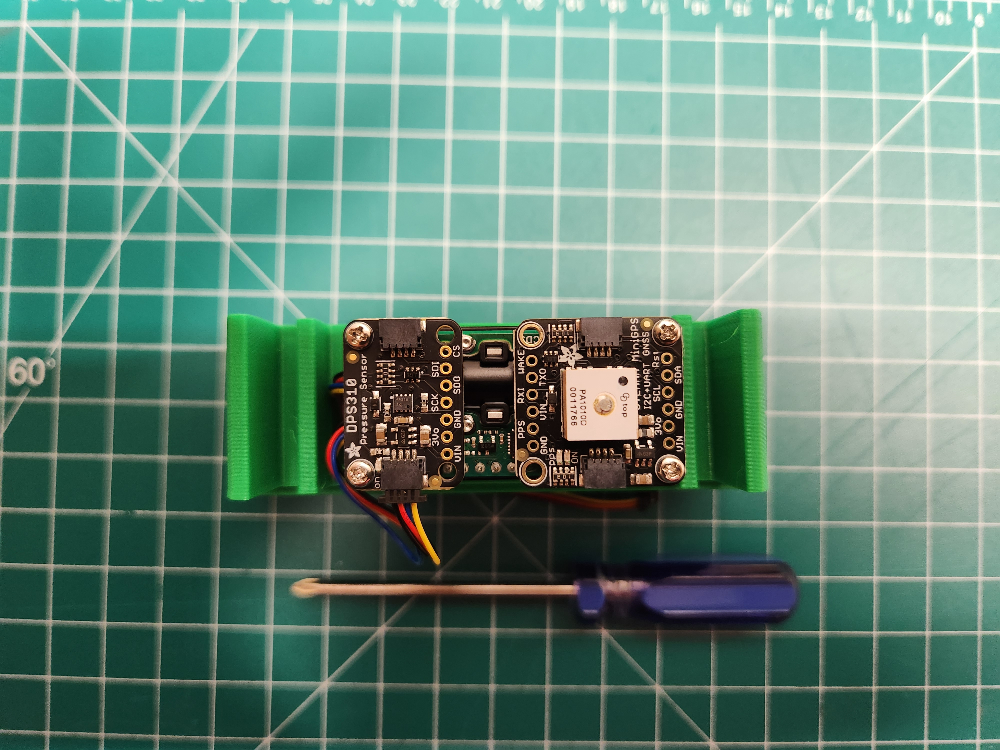

Now use the second 50mm cable to connect the barometer and GPS

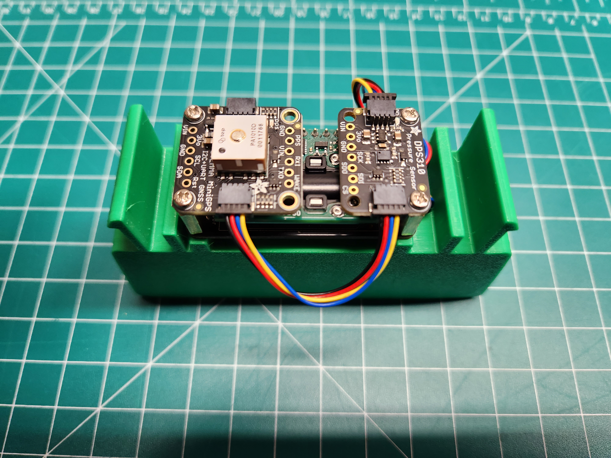

## Install the ESP32 Feather

First, connect the 100mm cable to the port in the center of the ESP32.  Then connect the USBC 90 degree adapter to the power port.

Note: you may need to remove the cap from the port in the center of the ESP32.

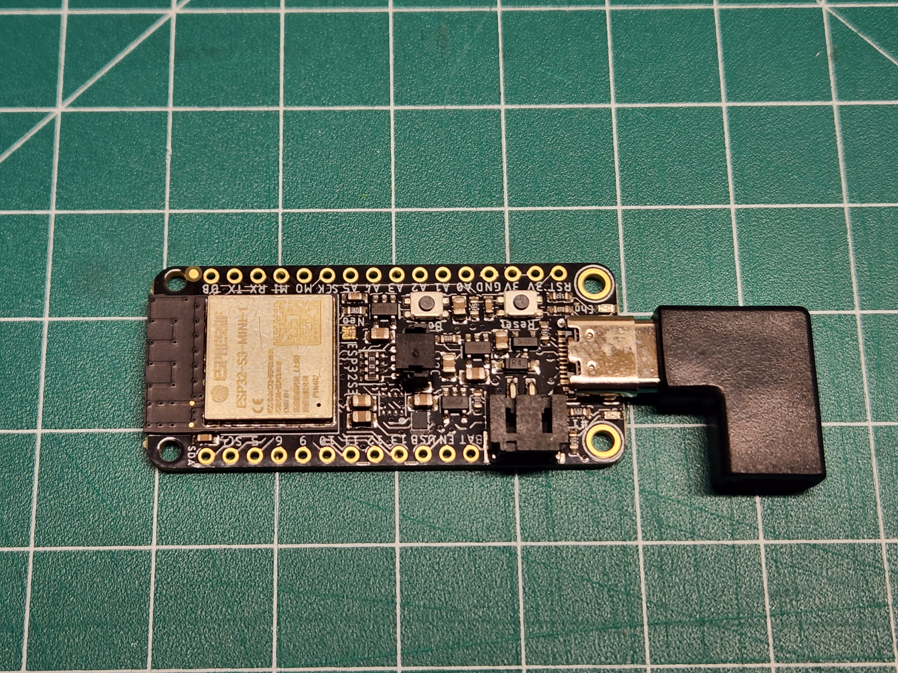

Now the ESP32 can be mounted in the enclosure base using the remaining two M2.5 screws and the small phillips screw driver.

## Assemble the Enclosure

Now we can move on to assembling the enclosure.  The lid will come first.  
Simply snap the lid into place on top of the base.

## Snap on the Shroud
The lower shroud snaps into place.

To snap in place, slide one side of the shroud into place on the clip.  Then press firmly on the other side to snap it down as well.

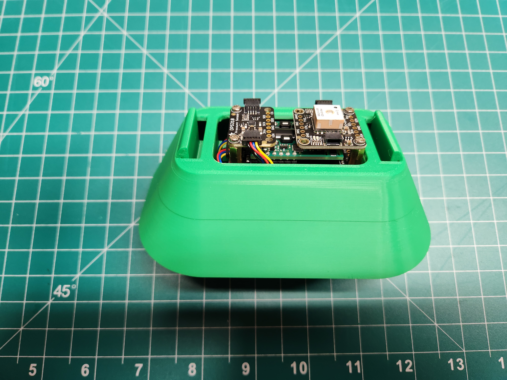

## Assemble the Frog Head
The eyes and mouth need to be glued in place (if printed separate from the head)

Use super glue and place the eyes and mouth just like in the picture:

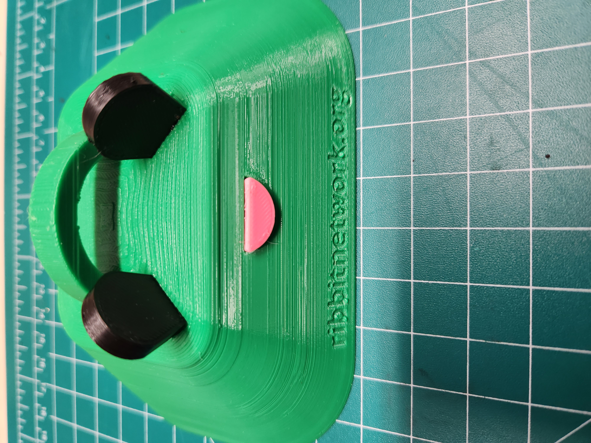

## Install the Frog Head
The frog head snaps on top of the shroud.

Use firm, but not excessive, pressure to snap the Frog Head into place.  This snap functions just like the shroud in the previous step.

## Assembly Complete!
The assembly is complete! Now we just need to place our sensor outside!

The power cable can be routed through the bottom:

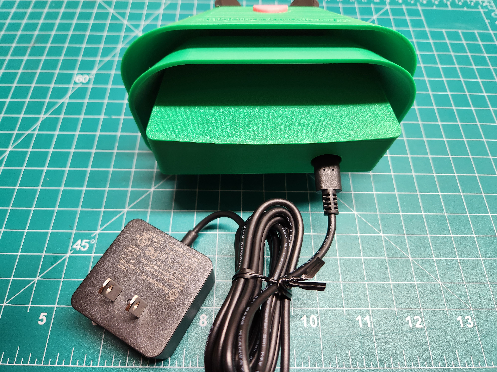

The Frog Sensor can be hung using the loop on top, or the nail hook on the back.  

## Additional Hanging Options
We have also created dfferent hanging accessories to make hanging your sensor even easier.  These can be found in [3D Printing](2-3d-printing.md). There are currently two additional options that can be printed:

First is the S-hook:

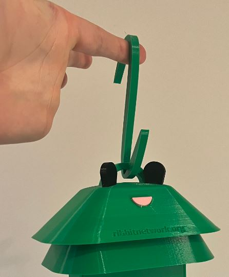

Second is the post mount hanger:
Use the zip ties to strap around a post and secure in place.

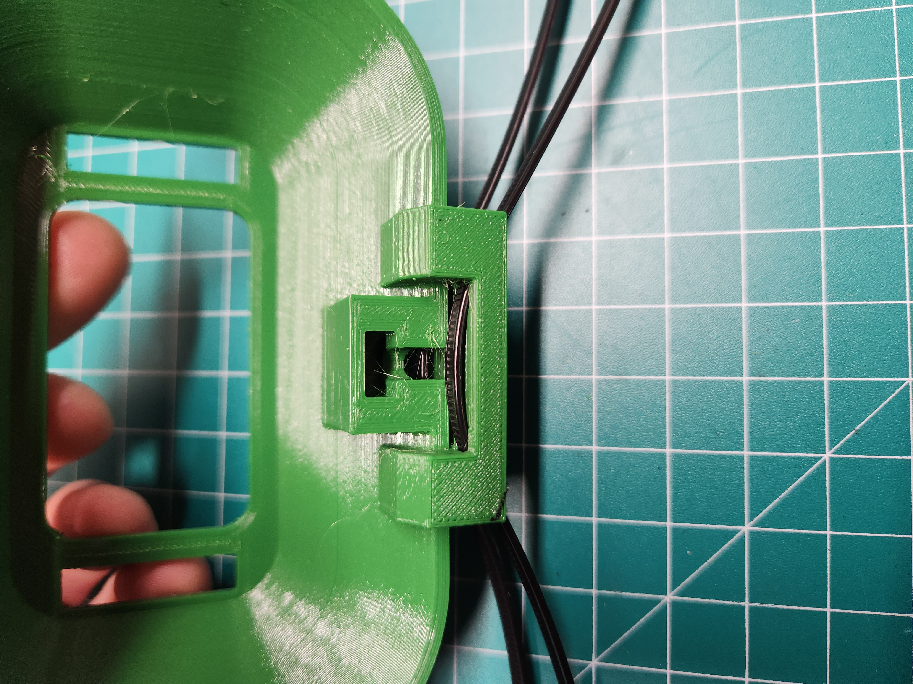
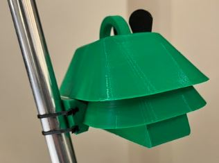

## Next Step
[Sensor Placement](5-sensor-placement.md)

## Table of Contents
[Return to the Beginning](0-start-here.md)

## Need Help?
No problem! The Ribbit Network team is here for you! We have lots of ways to connect. Jump in and ask your question or provide a suggestion!
* [Start a discussion here](https://github.com/Ribbit-Network/ribbit-network-frog-sensor/discussions/new)
* [Join the Developer Discord](https://discord.gg/vq8PkDb2TC)
